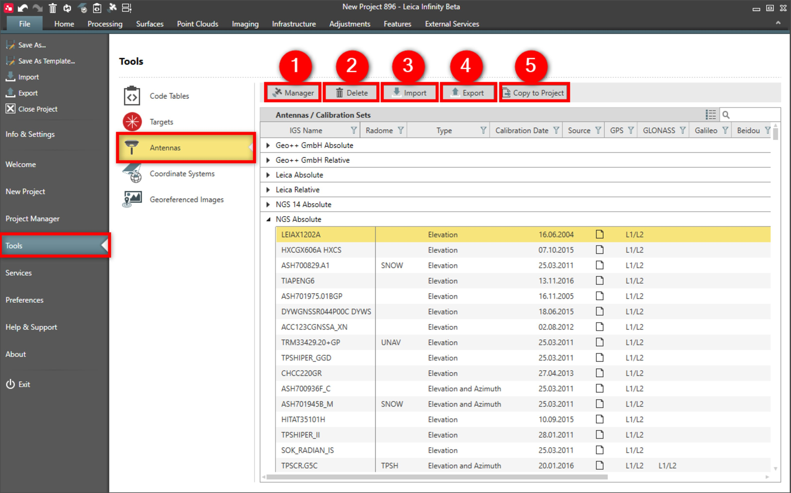

# Overview

### Antennas

Antennas can be managed in the antennas list. Infinity provides a default list of antennas and calibration sets.

By default, the following calibration sets are available:

**By default, the following calibration sets are available:**

- **GEO++ GmbH Absolute** and GEO++ GmbH Relative: Include elevation and azimuth calibration values for Leica antennas.
- **Leica Absolute** and Leica Relative: Include elevation and azimuth calibration values for Leica antennas.
- **NGS 14 Absolute** and NGS Absolute: Include elevation and azimuth calibration values for Leica and third-party antennas.

NGS calibration set, provides the antenna calibration values published by NGS at the following link: https://www.ngs.noaa.gov/ANTCAL/.

In antennas you can do the following:

**In antennas you can do the following:**

|  |  |
| --- | --- |

| No. | Name | Description |
| --- | --- | --- |
| 1. | GNSS Manager | Manage antenna calibration sets, RINEX data from permanent reference stations, precise ephemeris, ionospheric models and predict the satellite availability. |
| 2. | Delete | Delete user defined or imported antennas. |
| 3. | Import | Import antennas. |
| 4. | Export | Export antennas. |
| 5. | Copy to Project | Copy antennas from global list into open project. |

See also:

**See also:**

Local and Global Data Objects

Antennas/Calibration Sets

The tutorial "How to Manage an Antenna Calibration Set" https://leica-geosystems.com/-/media/a633447d1f3f4afc8c7abf4a1685be6a.ashx

**"How to Manage an Antenna Calibration Set"**

The tutorial can be downloaded in the Localisation Tool.

