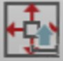
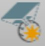
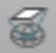
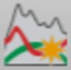
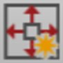
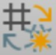
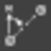

# Overview

### Coordinate System Manager

In the coordinate system manager, you can create and manage all the components that constitute a coordinate system, for example Transformations, Ellipsoids and Projections as well as Geoid Models and CSCS Models.

To open the coordinate system manager:

**To open the coordinate system manager:**

| 1. | Select File > Tools > Coordinate Systems. |
| --- | --- |
| 2. | Select the    Manager option to open the Coordinate System Manager. |

**File**

**Tools**

**Coordinate Systems**

**Manager**

The ribbon bar gives access to the following actions:

**The ribbon bar gives access to the following actions:**

| Data |
| --- |
|  | Import existing coordinate systems from:SmartWorx DBX (*.xcf).*.dat files.HeXML/LandXML.LGO CSYS.Trimble *.DC/*.CAL/*.JXL.iCON/SBG Geo *.lok.Infinity Coordinate System file*.csys. |
|  | Export coordinates systems as:Infinity Coordinate System files in *.csys.Global Transformation Sets TRFSET.dat files.iCON/SBG Geo *.lok. |
|  | Copy to Project, to copy selected coordinate systems to the current project. |
|  | Report, to get a coordinate system report. |
|  | Create Geoid Model, to create a new geoid model. |
|  | Create CSCS Model, to create a new CSCS model. |
| New |
|  | Coordinate System, to create a new coordinate system. |
|  | Transformation, to create a new transformation. |
|  | Ellipsoid, to create a new ellipsoid. |
|  | Projection, to create a new projection. |
|  | Geoid Model, to create a new geoid model. |
|  | CSCS Model, to create a new CSCS model. |
|  | Determine Transformation, to determine a new transformation. |
| Edit |
|  | Delete coordinate systems from the list. |

**Data**

**Import**

- SmartWorx DBX (*.xcf).
- *.dat files.
- HeXML/LandXML.
- LGO CSYS.
- Trimble *.DC/*.CAL/*.JXL.
- iCON/SBG Geo *.lok.
- Infinity Coordinate System file*.csys.

**Export**

- Infinity Coordinate System files in *.csys.
- Global Transformation Sets TRFSET.dat files.
- iCON/SBG Geo *.lok.

**Copy to Project**

**Report**

**Create Geoid Model**

**Create CSCS Model**

**New**

**Coordinate System**

**Transformation**

**Ellipsoid**

**Projection**

**Geoid Model**

**CSCS Model**

**Determine Transformation**

**Edit**

**Delete**

To be able to copy a coordinate system to a project, the project has to be open. You can only copy coordinate systems to the project which are not attached already.

In the Properties window you are shown the properties of any selected item, be that a coordinate system, a transformation, an ellipsoid, a projection, a geoid model or a CSCS model.

Some properties are editable. Confirm any changes with Apply.

**Apply**

In the status bar at the bottom:

**In the status bar at the bottom:**

- Select the    option to hide or show the Properties window.
- Change the    linear and    angular units and the available decimal places if necessary.
- Change the way latitude and longitude are displayed if necessary.

The functionality is similar to the status bar in the main frame.

See also:

**See also:**

Status Bar

If you have long lists use the    Search functionality to find an item.

**Search**

