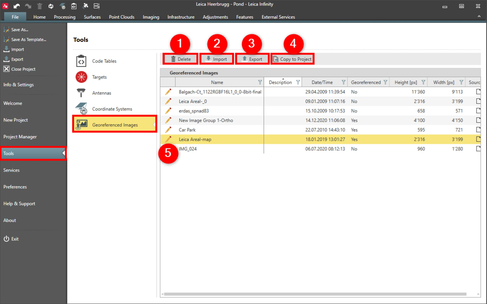

# Overview

### Georeferenced Images

Infinity supports the display of georeferenced images as a background. The use of these images is a nice way to help visualise, reference and relate your project data.

Georeferenced images are shown as objects in the library and can be set to visible or not visible. It is possible to use many georeferenced images. An existing georeferenced Image can be edited and updated with a new transformation.

In georeferenced images you can do the following:

**In georeferenced images you can do the following:**

|  |  |
| --- | --- |

| No. | Name | Description |
| --- | --- | --- |
| 1. | Delete | Delete a georeferenced image from the global library. |
| 2. | Import | Import georeferenced images or images you want to georeference. |
| 3. | Export | Export georeferenced images. |
| 4. | Copy to Project | Copy georeferenced images to be used in the project. |
| 5. | Georeference Images | Open georeference image wizard to edit an existing or to calculate a new transformation. |

See also:

**See also:**

Local and Global Data Objects

The video "Leica Infinity - Home Module - Georeferencing Images" https://www.youtube.com/watch?v=m-U29-ipJgs

**"Leica Infinity - Home Module - Georeferencing Images"**

