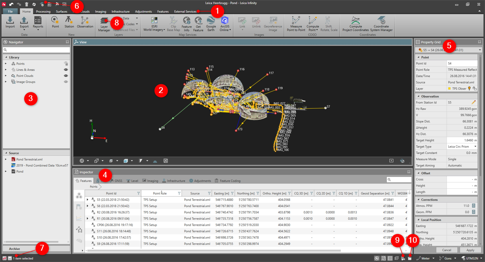

# Overview

### Working with the User Interface

When we open a project we see the layout of the user interface. The layout of the user interface can be split into several parts which are highlighted in the following graphic.

|  |  |
| --- | --- |

| No. | Name | Description |
| --- | --- | --- |
| 1. | Ribbon Bar | Explore functions and tools grouped into modules. |
| 2. | Graphical View | View the project content graphically in 2D or 3D. |
| 3. | Navigator | Navigate through the project content. |
| 4. | Data Inspector | View project content in table format. |
| 5. | Property Grid | View the properties of a selected data item. |
| 6. | Quick Access Bar | Get quick access to some important functions. |
| 7. | Status Bar | See current settings. |
| 8. | Layer Manager | Change the layer status and their graphical settings. |
| 9. | BIM Explorer | Inspect the structure of IFC files. |
| 10. | Flythrough Creator | Create video with defined flythrough methods. |

See also:

**See also:**

Window Behaviour

Objects, Point Roles and Symbols

