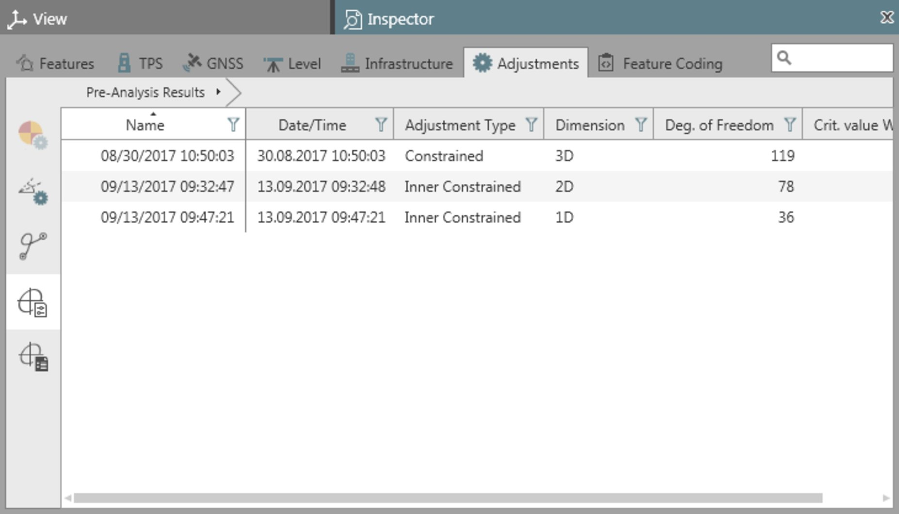
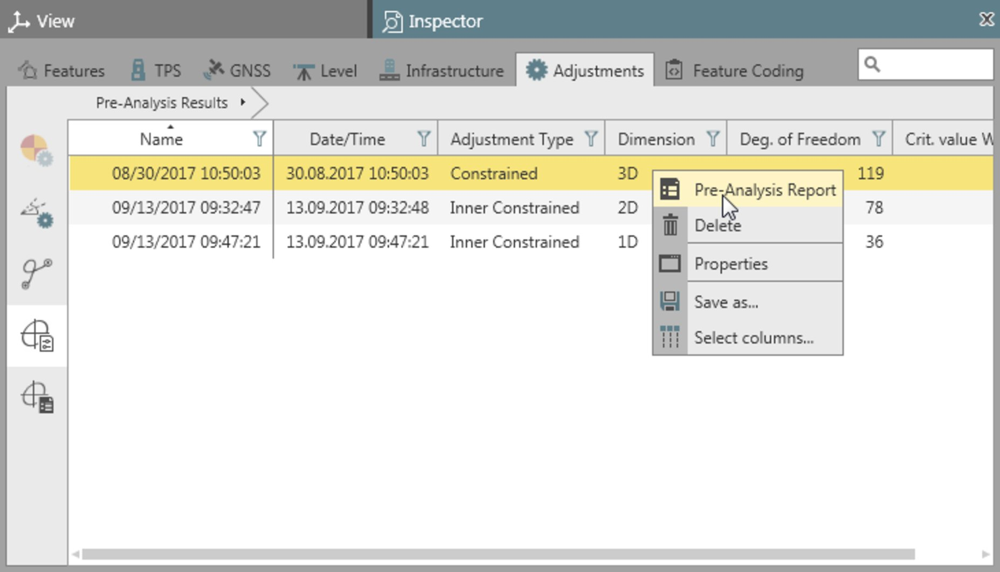

# Pre-Analysis

### Pre-Analysis

Pre-analysis is a tool that can be used:

**Pre-analysis is a tool that can be used:**

- To detect possible weaknesses in a surveying network before adjustment.
- To detect unknowns which cannot be solved.
- To check input data.

To run a pre-analysis:

**To run a pre-analysis:**

Select    Run Pre-Analysis from the Adjustments ribbon bar.

**Run Pre-Analysis**

Select from the drop-down menu whether you want to compute 3D (position and height), 2D (position only) or 1D (height only) loops. By default, loops are computed according to the main adjustment settings.

**3D**

**2D**

**1D**

Computation results are available under    Pre-Analysis Results subtab under the Adjustments tab in the Inspector.

**Pre-Analysis Results**

|  |  |
| --- | --- |

The results of all pre-analysis computations are kept in the list until you select them and delete them.

To delete a result from the list right-click upon it and select    Delete from the context menu.

**Delete**

Pre-Analysis Reports

**Pre-Analysis Reports**

In order to inspect results in detail select a computation run and open the Pre-Analysis Report from the context menu.

**Pre-Analysis Report**

|  |  |
| --- | --- |

### Pre-Analysis Report

You can generate a report for each result listed in the inspector in order to inspect details of a pre-analysis.

The inspector itself does not allow for any drilling-in to results of a pre-analysis.

To generate a pre-analysis report:

**To generate a pre-analysis report:**

| 1. | Select a computation result in the Inspector |
| --- | --- |
| 2. | Select    Reports from the Adjustments ribbon bar and select Pre-Analysis Report from the drop-down menu.Or:Right-click and open the Pre-Analysis Report from the context menu. |

**Reports**

**Pre-Analysis Report**

**Pre-Analysis Report**

The report opens up in a separate window and can be saved as a PDF or HTML file. Both types of file are added to the navigator under Archive > Reports and can be opened from there again.

**Archive**

**Reports**

The pre-analysis report includes the following information:

**The pre-analysis report includes the following information:**

- **Configuration Defects:**This sections reports upon singularities that may come up when a network is adjusted. It lists unknowns that cannot be solved, either because of the network geometry or because of the type of observations or because of the coordinate system that shall be used for the adjustment.
- **Comparison of Identical Observations:**This section reports upon multiple observations to the same point that differ by a certain amount and may, therefore, be suspect. If there is a high probability that an error exists, the W-Test value is marked with bold red text. Other possibly suspect observations are left to your discretion.
- **Comparison of Observations and Approximate Coordinates:**This section reports upon observations checked against the pseudo-observations, that are derived from  approximate coordinates. Observations, for which a large difference is identified, are listed.
- **Possibly Identical Observations:**This section reports upon observations which are suspected to be identical. You may want to investigate if observations are really separate.
- **Possibly Coinciding Stations:**This section reports upon stations which coincide with a distance of less than 2 metres. Such stations are suspected to be identical, though they have not been given the same point ID.

Depending on your data additional warning messages may appear after the last section of a pre-analysis report.

