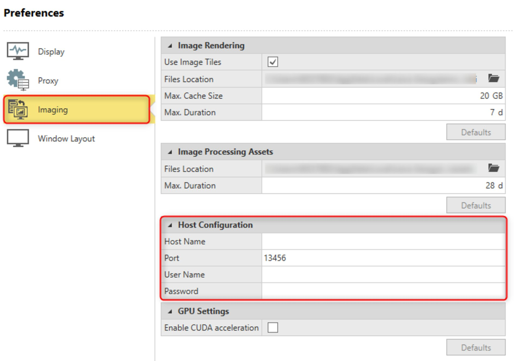

# Processing Considerations

### Processing Considerations

The number of images that can be processed with Infinity depends on several factors:

**The number of images that can be processed with Infinity depends on several factors:**

- **RAM**: The image group size or Gpx size is related to the amount of system **RAM**. It is important to consider the size of data sets to be processed to ensure the platform has enough system **RAM**. Processing times can also be reduced when enabling XMP profiles offering increased **RAM** speed.
- **CPU**: The processing is directly affected by the speed of the **CPU**. Consider a high clock speed **CPU** (greater than 3 GHz) with a high boost speed (greater than 4.5 GHz). A **CPU** with high core count improves processing times, currently the biggest impact of cores is with the Dence Point Cloud (DPC) step.
- **GPU**: Using NVIDIA **GPU** is recommended with CUDA capabilities and speeds up the processing steps of the orientation and DPC.

Processing at half resolution is suggested as the best balance between density and completeness of data and time to process. For high-resolution images > 36 MP, quarter resolution is also providing a good balance of data to process time.

When working with large data sets, creating several smaller image groups helps with the processing time.

Considering a 20 megapixel image, 16 GB of RAM is recommended to process 100-120 images at full resolution. The processing limits depend on the total pixel count of all images being processed.

It is possible to process images on the local machine or to use a dedicated worker host machine. When working with larger data sets its recommended to use a dedicated worker host.

### Suggested System Requirements

| Components | Minimum | Recommended | Recommended Worker Host |
| --- | --- | --- | --- |
| Windows Operating System | Windows 10 - 64 bit, Windows 11 | Windows 10 - 64 bit, Windows 11 | Windows 10 - 64 bit, Server 2022 |
| Processor Intel or AMD | Multi-Core base 2.5 GHz or greater | Octa-core 3.5 GHz or greater | Octa-core 4 GHz or greater |
| Memory | 32 GB DDR4 RAM | 128 GB DDR4 RAM XMP enabled | 128 GB or greater DDR4 RAM XMP enabled |
| Storage | 512 GB SSD | 2 TB or greater SSD | 2 TB or greater, multiple drives for storage |
| Graphics | 2 GB NVIDIA | 8 GB NVIDIA CUDA capable | 8 GB or greater NVIDIA CUDA capable |

**Windows Operating System**

**Processor Intel or AMD**

**Memory**

**Storage**

**Graphics**

### Setup Worker Host

The image processing tasks can be sent to a different computer (host) for processing, as long as the following requirements are met:

**The image processing tasks can be sent to a different computer (host) for processing, as long as the following requirements are met:**

- Both computers have an Infinity licence with the point clouds from images option.
- Both computers have the same version of Infinity.
- The Infinity image processing worker host is already running on the computer that to be used for processing.
- Infinity is running on the computer that sends the processing task.
- The computers are working within the same network.

By default, the host for image processing tasks is the local computer, that is the computer where the project is already running.

To define the host, do the following:

**To define the host, do the following:**

|  |  |
| --- | --- |

| 1. | Select File and then Preferences. |
| --- | --- |
| 2. | Select the Imaging tab. |
| 3. | Enter the necessary information regarding the Host Name, the Port, the User Name and the Password. |

**File**

**Preferences**

**Imaging**

