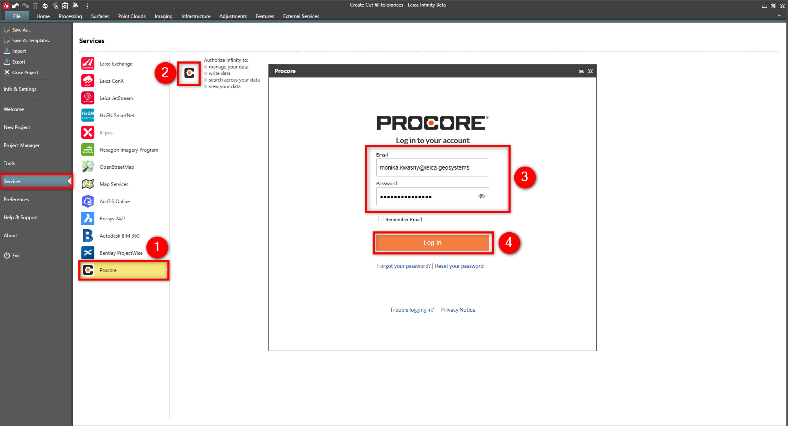
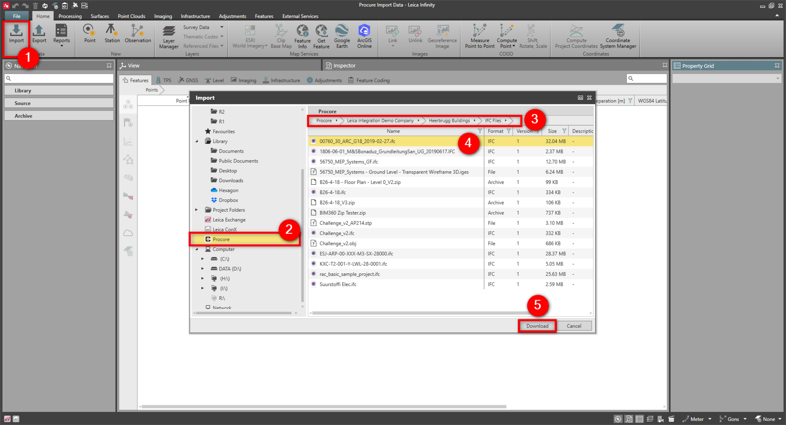
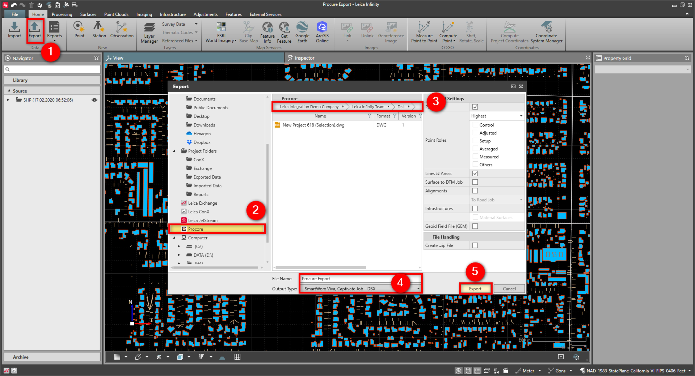

# Procore

### Procore

Infinity supports the Procore service.

Easily transfer data between Infinity and the Procore service.

**Requirements:**

- Valid subscription.

To connect to the Procore service:

**To connect to the Procore service:**

|  |  |
| --- | --- |

| 1. | Select File, then Services and then Procore from the menu. |
| --- | --- |
| 2. | Select Procore. |
| 3. | Enter your User Name and Password. |
| 4. | Select Log In.Login is controlled with Internet Explorer autocomplete settings. Selecting the Procore icon logs the current user out of the Procore service. |

**File**

**Services**

**Procore**

**Procore**

**User Name**

**Password**

**Log In**

Login is controlled with Internet Explorer autocomplete settings. Selecting the Procore icon logs the current user out of the Procore service.

To import data:

**To import data:**

|  |  |
| --- | --- |

| 1. | Select Import from the Home tab. |
| --- | --- |
| 2. | In the Import window, select Procore. |
| 3. | View the available files in the Procore window. |
| 4. | Highlight the file to import to the project. |
| 5. | Select Download.The selected file is imported to Infinity and downloaded to the Procore directory, in the current Infinity project directory. |
| 6. | Select the data and if necessary specify import settings. |
| 7. | Select Import. |

**Import**

**Procore**

**Download**

The selected file is imported to Infinity and downloaded to the Procore directory, in the current Infinity project directory.

**Import**

To export data:

**To export data:**

|  |  |
| --- | --- |

| 1. | Select Export from the Home tab. |
| --- | --- |
| 2. | In the Export window, select Procore. |
| 3. | From the Procore window, select the directory to export the data to. |
| 4. | Select the data format and export settings. |
| 5. | Select Export. |

**Export**

**Procore**

**Export**

Depending on the project settings, Procore data is either copied to the current Infinity project directory or the downloads folder.

If the file name already exists, it is uploaded as a new version in the Procore directory.

Folders cannot be updated if the folder name already exists in the Procore directory.

See also:

**See also:**

The video "Leica Infinity - Services - How to use the Procore service" https://www.youtube.com/watch?v=ZtmIA7XlQ0M

**"Leica Infinity - Services - How to use the Procore service"**

