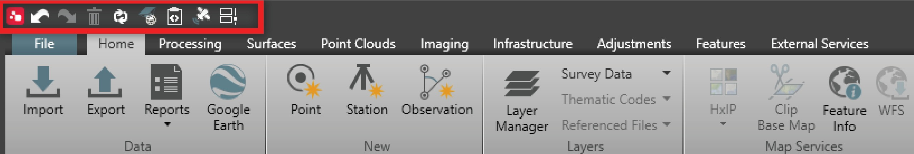
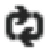
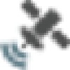

# Quick Access Bar

### Quick Access Bar

The quick access bar is at the top left corner of the Infinity window and is active with an open project. It enables quick access to some important functions:

| Icon | Description |
| --- | --- |
|  | Undo an operation. It is possible to undo multiple times. |
|  | Redo an operation. It is possible to redo multiple times. |
|  | Delete any selected item from the navigator, the data inspector or the graphical view. |
|  | Refresh to refresh all windows and reset the graphical view. |
|  | Open the coordinate system manager. |
|  | Open the code table manager. |
|  | Open the GNSS manager. |
|  | Open the task manager to monitor the image-processing tasks. |

**Undo**

**Redo**

**Delete**

**Refresh**

**Open**

**Open**

**Open**

**Open**

