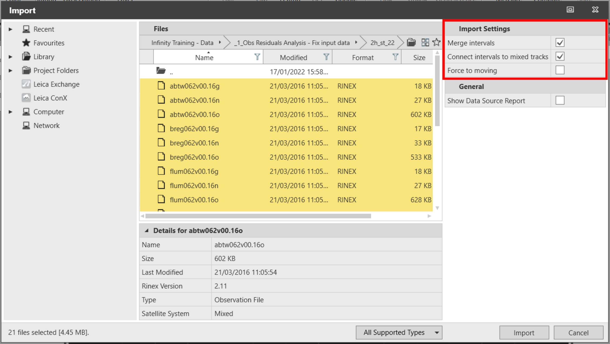

# RINEX Import

### RINEX Import

The standard and most common format to store and share GNSS raw data is the Receiver Independent Exchange Format (RINEX). RINEX data can be easily imported in Infinity from the import dialog or using drag and drop.

Infinity also supports the import of the GNSS data in proprietary format, such as Leica (.mdb), NovAtel (.gps and .dat) and u-blox (.ubx).

Import dialog:

**Import dialog:**

|  |  |
| --- | --- |

Import Settings

**Import Settings**

Merge intervals:

**Merge intervals:**

The merge intervals functionality is normally used when importing data from permanent reference stations. If more than one GNSS interval is contained in the data then this function merges any observation intervals that conform to the following conditions:

- The gap between any two consecutive intervals is less than 30 minutes.
- The point ID are identical for consecutive intervals.
- The antenna type is identical for consecutive intervals.
- Coordinates are the same for consecutive intervals.

Connect intervals to mixed tracks:

**Connect intervals to mixed tracks:**

This setting is used for consecutive measuring sessions of static and moving GNSS raw data.

Check this box to create a unique GNSS interval, containing static and moving data (Mixed Track).

Force to moving:

**Force to moving:**

Check this box to import static data as moving data.

This checkbox helps to overcome storing issues happened on the field (for example, you collected moving data, but the receiver stored the data as static).

