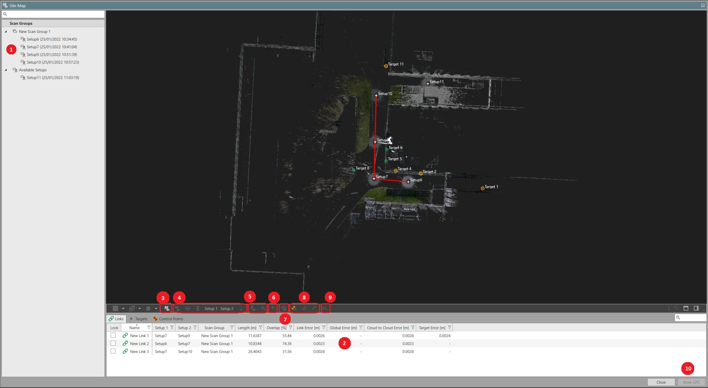

# Register Tool Workflow

### Register Tool Workflow

The register tool has several different elements to facilitate the registration workflow.

|  |  |
| --- | --- |

| No. | Name | Description |
| --- | --- | --- |
| 1. | Registration Tool Navigator | View all the imported scan setups organised in scan groups or available setups. |
| 2. | Register Tool Bottom Menu | View links, targets and control points. |
| 3. | Site Map View | View and organise scan data in 2D top down view. |
| 4. | Visual Alignment | Display two selected setups and create link between them. |
| 5. | Scan Setup View | View scan setup from scanner position to view the data and create targets. |
| 6. | Match Targets | Create link based on targets. |
| 7. | Scan Group View | View scan group in 3D view. |
| 8. | Georeference the Scan Group | Auto assign control points by ID, apply control points by geometry and apply control points. |
| 9. | Optimise | Optimise the scan group. |
| 10. | Store UPC | Store Unified Point Cloud (UPC) in the Infinity project. |

**Registration Tool Navigator**

**Register Tool Bottom Menu**

**Site Map View**

**Visual Alignment**

**Scan Setup View**

**Match Targets**

**Scan Group View**

**Georeference the Scan Group**

**Optimise**

**Store UPC**

Register Tool Navigator

**Register Tool Navigator**

This window allows you to select the setups and align them to build the scan group.

The data can be organised in:

**The data can be organised in:**

- **Scan Groups**: The scan groups show all scan groups in the current Infinity project.
- **Available Setups**: The available setups shows all setups that are not part of a scan group.

Register Tool Bottom Menu

**Register Tool Bottom Menu**

This window displays all the information about the scan group:

**This window displays all the information about the scan group:**

- **Links Subtab**: Shows all links in the current Infinity project.
- **Targets Subtab**: Shows all targets in the current register view.
- **Controls Subtab**: Shows all controls in the current register view.

Site Map View

**Site Map View**

The Site Map view is a 2D-only view to select and move setups to organise and make it easier to register.

The following controls are available:

**The following controls are available:**

- **Shift Setup or Scan Group**: Left-click mouse on a setup to shift a setup or scan group.
- **Rotate Setup or Scan Group**: Left-click mouse + Shift key on a setup to rotate a setup or scan group.
- **Multi-Object Selection**: Left-click mouse + Ctrl key.
- **Fence Selection**: Left-click mouse + Shift key on the open space.
- **Context Menu**: Right-click mouse on an object for the context menu options.

Visual Alignment View

**Visual Alignment View**

The visual alignment view displays two selected setups to perform a cloud-to-cloud registration.

The following controls are available in top view:

**The following controls are available in top view:**

- **Shift Setup**: Left-click mouse to shift the active setup.
- **Rotate Setup**: Left-click mouse + Shift key to rotate the active setup.

The following controls are available in front/back/left/right views:

**The following controls are available in front/back/left/right views:**

- **Shift Setup Along Z-axis**: Left-click mouse on a setup to shift the active setup along the Z-axis.
- **Tilt Setup About View Axis**: Left-click mouse + Shift key to tilt the active setup about the view axis.

Setup View

**Setup View**

The setup view displays the setup cloud of the selected setup.

The setup view can be used to:

**The setup view can be used to:**

- View and inspect the setup cloud using existing Infinity view controls.
- Mark user targets.

Match Targets

**Match Targets**

Match targets creates the link between two or more scan setups based on a minimum of three matching targets.

Where matching target labels exist, the match targets algorithm attempts to align the setups based on the labels.

Where no matching labels exist, the match targets routine attempts to align the setups by target geometry.

Scan Group View

**Scan Group View**

The scan group view displays the scan group cloud of the selected scan group. The scan group view can be used to interrogate the scan group cloud using existing Infinity view controls.

Georeferencing the Scan Group

**Georeferencing the Scan Group**

Use the controls assigned to targets to bring the scan group to project coordinate system.

- **Auto Assign Control Points by ID**: Match target and control points with the same point ID if not manually matched.
- **Apply Control Points by Geometry**: Match targets and control points by comparing their 3D position (geometry). Assign the control to the scan group, to transform it to the project coordinate system. Target ID is automatically changed to match that of the control point.
- **Apply Control Points**: Assign the control points to the scan group to transform it to the project coordinate system.

Optimise

**Optimise**

Final optimisation of the scan group, updating all links and scan setup positions before storing the UPC.

Store Unified Point Cloud

**Store Unified Point Cloud**

Store the UPC to be used in the Infinity project.

Register Strip

**Register Strip**

The register strip is at the bottom of the register tool view and provides access to the functions provided by the registration module.

