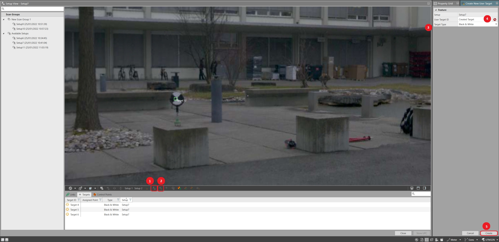

# Registration Using Targets

### Registration Using Targets

This article covers the process of registration using targets in Infinity.

Target Creation

**Target Creation**

Targets can be created in Infinity in a number of ways:

**Targets can be created in Infinity in a number of ways:**

- **Black & White Target Extraction**: Ensure that the auto Black & White, Targets Type checkbox is ticked in the import window. This option also attempts to align and join scans with matching targets as part of the process.Black & white target can also be extracted in the Setup View, select Create New User Target and select Black and White as Target Type.
- **User Target Creation**: When in the Setup View, select Create New User Target from the register strip and select User as the Target Type. You can then mark user targets on the setup cloud by a left-click of the mouse.

Any part of the setup cloud can be used to mark a user target, facilitating the ability to join setup clouds using objects that are not necessarily the targets.

User target creation:

**User target creation:**

|  |  |
| --- | --- |

| 1. | Open the Setup View. |
| --- | --- |
| 2. | Select Create New User Target. |
| 3. | Select Target Type (Black & White OR User). |
| 4. | Mark the the target and enter a User Target ID.The tool follows the same logic as create new point. It is possible to relabel the target during target creation. The next created target, takes the name after the previous one and follows the numbered sequence.Black & white target is always extracted at the centre of an existing black & white target visible on the point cloud. User targets are created at the point picked on the setup. |
| 5. | After all the targets are created, select Create. |

**Setup View**

**Create New User Target**

**Target Type**

**User Target ID**

The tool follows the same logic as create new point. It is possible to relabel the target during target creation. The next created target, takes the name after the previous one and follows the numbered sequence.

Black & white target is always extracted at the centre of an existing black & white target visible on the point cloud. User targets are created at the point picked on the setup.

**Create**

Target Labelling

**Target Labelling**

Targets can be labelled in Infinity in a number of ways:

**Targets can be labelled in Infinity in a number of ways:**

- By entering a defined text string in the Target ID field of the targets Property Grid.
- By selecting a matching target from another setup using the    option in the Target ID field of the targets Property Grid.

See Applying Control for further information on applying control to targets.

Changing one target label automatically relabels all matched targets.

Matching Targets

**Matching Targets**

To join setups with a minimum of three matching targets:

**To join setups with a minimum of three matching targets:**

- Select two or more setups from the register tool navigator or register tool.
- Select **Match Targets** from the register strip.

Where matching target labels exist, the match targets algorithm attempts to align the setups in the following order:

**Where matching target labels exist, the match targets algorithm attempts to align the setups in the following order:**

- By label.
- By target geometry.

Where no matching labels exist, the match targets routine attempts to align the setups by target geometry.

Once the setups have been aligned using the targets, they are joined using cloud-to-cloud.

Targets State:

**Targets State:**

