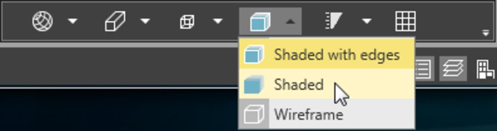

# Reliability Boxes

### Reliability Boxes

External reliability can be expressed in terms of reliability boxes. For each station in a project a reliability box is computed as a means to express the influence of a possible error in the observations or of known coordinates on the adjusted coordinates. In constrained adjustments  the selection of control points that shall remain fixed during adjustment has a direct influence on the reliability boxes. The box represents the area that the adjusted station is in (with a probability of 80%) if all observations and known coordinates of the network are accepted by the statistical tests. Depending on the possible error or known coordinate with the largest influence on the adjusted coordinate, the size of the box is computed according to the size of the minimum detectable bias.

To show the reliability boxes in the graphical view:

**To show the reliability boxes in the graphical view:**

| 1. | Run a network adjustment in 2D or 3D. |
| --- | --- |
| 2. | Store the result. |
| 3. | Activate (switch on:   ) the Reliability layers in the Layer Manager. |
| 4. | Switch the graphical view to display objects as Shaded or Shaded with Edges. |

**Reliability**

**Shaded**

**Shaded with Edges**

For further information on how to run adjustments and store results, see Adjustments.

If the graphical view is in 2D mode, then squares are shown (instead of 3D boxes).

On how to switch between standard views, see Graphical View.

Illustration:

**Illustration:**

|  |  |
| --- | --- |

If errors are too small, go to Settings > General and enlarge the Visualisation Exaggeration Factors. Else you might not be able to see the reliability boxes.

**Settings**

**General**

**Visualisation Exaggeration Factors**

If errors are below the given threshold value they are not be shown. Set the threshold to a value smaller than the errors.

See also:

**See also:**

General Adjustment Settings

