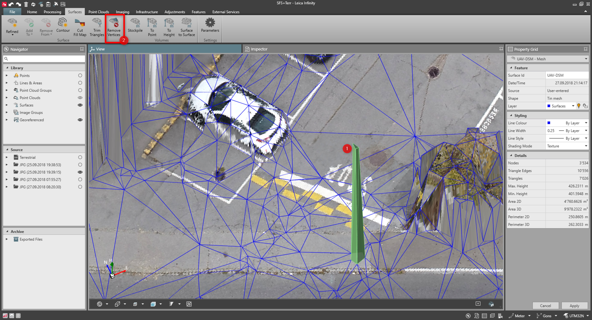

# Remove Vertices

### Remove Vertices

It is possible to remove vertices from a surface when spikes or areas of triangles have been created but not wanted.

Removing the vertices does not create holes.

How to remove vertices:

**How to remove vertices:**

|  |  |
| --- | --- |

| 1. | Select all triangles that contribute to a vertex. |
| --- | --- |
| 2. | Remove vertices either from the ribbon bar or from the context menu.The triangles are locally reorganised. |

The triangles are locally reorganised.

