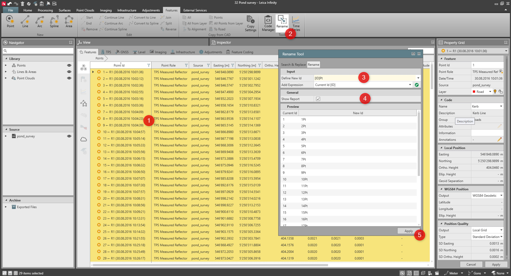

# Rename

### Rename

The rename tool, allows you to rename a selection of point ID, and likewise line, area, image and point cloud ID.

You can rename the selected items:

**You can rename the selected items:**

- Using search & replace to replace (or remove) some characters.
- Using rename by renumbering starting from a specific value using a counter.
- Using rename by adding fixed characters to the current ID.

Search & Replace

**Search & Replace**

To search:

**To search:**

You may search for parts of the current ID that shall be renamed and replace these parts with a new combination of alphanumeric characters.

You may also search for spaces, dashes, dots and underscores to be replaced.

To replace:

**To replace:**

Define a replacement for the search string. Spaces, dashes, dots and underscores may also serve or be included as part of the replace string. If you want to remove a fixed part of the current ID leave the replace string empty.

Rename

**Rename**

To rename points, lines, areas, images or point clouds:

**To rename points, lines, areas, images or point clouds:**

|  |  |
| --- | --- |

| 1. | In the Inspector, go to the Points, Lines & Areas tab or to the Observations tab and select the items you want to rename.In the Navigator, items can be selected from the Library section. Points can also be selected from inside the Source section by selecting the job.Alternatively, you can also select items in the graphical view. |
| --- | --- |
| 2. | Select the Rename option in the Features ribbon bar or select Rename from the context menu to open the Rename Tool. |
| 3. | Define a new ID. |
| 4. | Check the Show Report checkbox to show the Rename Report. |
| 5. | Select Apply. |

**Points, Lines & Areas**

**Observations**

**Library**

**Source**

**Rename**

**Features**

**Rename**

**Show Report**

**Apply**

When changing the selection, the items to rename are updated in the preview.

To remove a selected item from the list, so it is not renamed, select the items and select the Remove option.

**Remove**

To define a new ID:

**To define a new ID:**

Enter any combination of alphanumeric characters and/or add the expressions by selecting the Add option.

**Add**

Alternatively type [C], [ID] or [ID#-#].

To add an expression:

**To add an expression:**

Select an expression and select the Add option.

**Add**

Three expressions are available:

**Three expressions are available:**

| Numeric Counter [C]: | Numeric Counter for renumbering the ID. The following selection fields become active to define the counter:Start Counter at:Define the number to start counting with.Increment Counter by:Define how the counter shall be incremented.Counter-Digits:Define the digits that shall be reserved for inserting the counter. |
| --- | --- |
| Current ID [ID]: | The ID which the selected items currently have.To modify the current ID, you can enter any combination of alphanumeric characters or add a counter before or after. |
| Part of Current ID [ID #-#]: | A part of the ID which the selected items currently have.To modify a part of current ID, you can enter any combination of alphanumeric characters or add a counter before or after. |

**Numeric Counter [C]:**

**Start Counter at:**

**Increment Counter by:**

**Counter-Digits:**

**Current ID [ID]:**

**Part of Current ID [ID #-#]:**

