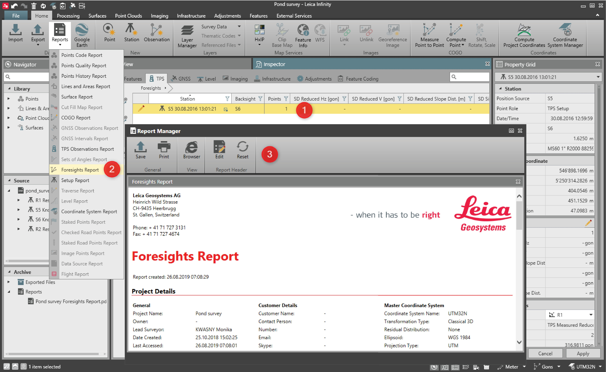
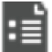

# Reports

### Reports

An important part of any project is the documentation of the data import, field work and project processing results. Run and store the reports and be aware of all the reports from the navigator archive.

To run a report:

**To run a report:**

|  |  |
| --- | --- |

| 1. | Select the objects that you want to have the report of. You can also select the results of processing or adjustment runs or of single volume calculations.In some cases, you can run reports on all the data of the project, such as points, TPS setups, TPS and GNSS observations. |
| --- | --- |
| 2. | Select the Foresights Report option in the Home tab or select Report from the context menu. |
| 3. | Report opens in Report Manager.Values exceeding limits are marked in bold red.Go to File > Info & Settings to set the tolerances as required. |

**Foresights Report**

**Home**

**Report**

Values exceeding limits are marked in bold red.

Go to File > Info & Settings to set the tolerances as required.

**File**

**Info & Settings**

For each report, the following operations are possible:

**For each report, the following operations are possible:**

| Icon | Description |
| --- | --- |
|  | Save the report as a PDF or HTML file. |
|  | Print the report. |
|  | Open the report in an Internet Browser. |
|  | Add an image/HTML file as a Report Header. |
|  | Reset the Report Header to the Leica default. |

Saved reports are seen in the Project Archive in the Navigator.

**Project Archive**

**Navigator**

For a selected report from within the context menu, the following operations are possible:

**For a selected report from within the context menu, the following operations are possible:**

| Icon | Description |
| --- | --- |
|  | Open the report. |
|  | Open the report in containing folder. |
|  | Remove the report. |
|  | Open properties. |

Reports on Data Sources

**Reports on Data Sources**

After importing a Captivate/SmartWorx DBX job, it is possible to run a report to document the imported state of the data source. In some cases editing of the imported data is necessary to fix various field errors or to shift the data from local to grid coordinates. You can run again the Data Source Report to store the edited state of the data source.

| 1. | Run report after import to document the field data as measured. |
| --- | --- |
| 2. | After edits have been made run a second report to document the current or final state of the field data. |

