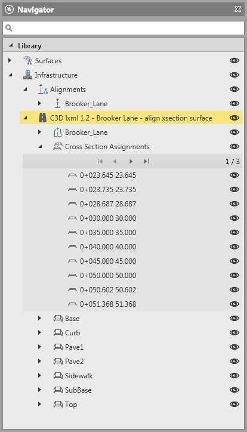
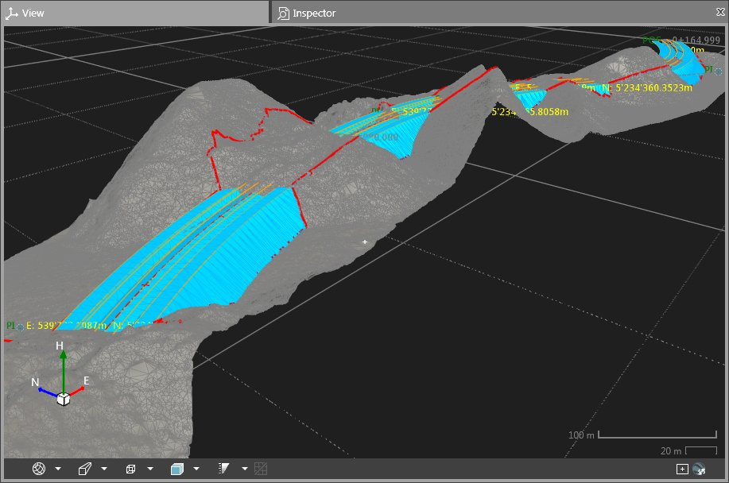
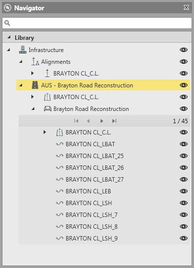

# Road Objects

### Road Objects

Road objects can be cross section based or stringline based.

Cross section based road objects:

**Cross section based road objects:**

Cross section based road objects consist of:

**Cross section based road objects consist of:**

| A 3D alignment that has been created or chosen to serve as its centreline. |
| --- |
|  | Any of the alignments available within the project can be chosen as centreline. |
| Cross section templates assigned to chainage values along the centreline. |
|  | Cross section templates remain in the project even if assignments are deleted. |
| Several material layers containing stringlines of the same level, material or phase of construction. |
|  | Daylight stringlines require a target surface to exist in the road object. |

- A 3D alignment that has been created or chosen to serve as its centreline.

Any of the alignments available within the project can be chosen as centreline.

- Cross section templates assigned to chainage values along the centreline.

Cross section templates remain in the project even if assignments are deleted.

- Several material layers containing stringlines of the same level, material or phase of construction.

Daylight stringlines require a target surface to exist in the road object.

Example:

**Example:**

|  |  |
| --- | --- |

Optionally a target surface can be assigned to the road object to visualise cut or fill slopes. It must be available within the project as a surface, before it can be chosen as target surface.

Example:

**Example:**

|  |  |
| --- | --- |

If the target surface is removed from the road object, the so-called daylight stringlines which indicate the intersection of the road design with the terrain model also disappear.

Stringline based road objects:

**Stringline based road objects:**

Road objects imported from external files often come in in the form of a list of stringlines.

In this case the stringlines define the road object, which has typically been calculated in a 3rd party software and sent to Infinity for its preparation and conversion to a field-compatible format.

Example:

**Example:**

|  |  |
| --- | --- |

Any of the stringlines available within the road object can be set as centreline:

**Any of the stringlines available within the road object can be set as centreline:**

Right-click on the stringline and select Set as Centreline from the context menu.

**Set as Centreline**

To create a new road object:

**To create a new road object:**

| 1. | Select Road from the Infrastructure ribbon bar.Next to the Property Grid the New Road tab opens up. |
| --- | --- |
| 2. | Enter the road properties.Go to Details and select    Edit next to Centreline to optionally select a centreline. All alignments available in the project are available for selection.Select    Edit next to Target Surface to optionally select a target surface. All surfaces available in the project are available for selection.Having a target helps when you intend to assign cross sections to the road. |
| 3. | Select Create. |

**Road**

**Edit**

**Edit**

**Create**

The new road object is added to the list in the navigator and the inspector.

To edit a road object:

**To edit a road object:**

| 1. | To edit a road right-click on the Road object and select    Edit from the context menu.The Infrastructure Manager opens up next to the Inspector. |
| --- | --- |
| 2. | To assign cross section templates go to the Cross Sections tab.Each assigned cross section is added under Cross Section Assignments in the Inspector and the Navigator. |
| 3. | Optionally add Material Layers.To add a new layer select Road Design > Material Layer in the Infrastructure ribbon bar. |

**Edit**

**Road Design**

**Material Layer**

When you assign cross sections to a stringline based road the nodes have to be assigned to material layers of their own.

Simple stringlines cannot share a material layer with stringlines resulting from cross section assignments.

