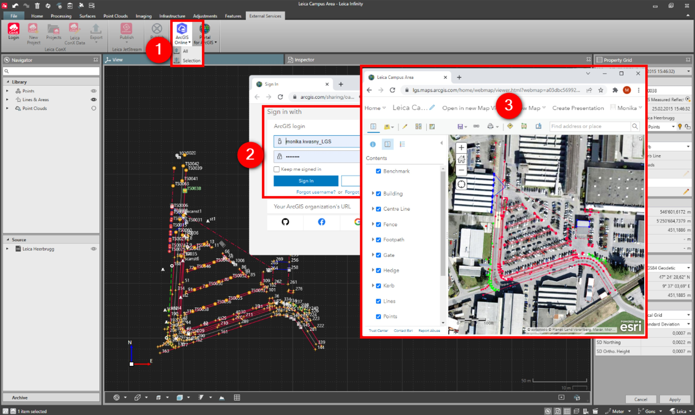

# Save as an ArcGIS Online Web Map

### Save as an ArcGIS Online Web Map

With the save as an ArcGIS Online web map, it is possible to upload Infinity project data to ArcGIS Online.

Either all library data or selected objects or reference files as .shp or .dxf/dwg can be exported.

**Requirements:**

- Logged in with ArcGIS Online.
- Subscription with rights to publish feature.
- Project data must have either WGS84 coordinates or coordinate systems attached.

To save the Infinity project as an ArcGIS Online web map:

**To save the Infinity project as an ArcGIS Online web map:**

|  |  |
| --- | --- |

| 1. | From within the open project, select the Save as ArcGIS Online Web Map option. |
| --- | --- |
| 2. | Sign in to your ArcGIS Online account. |
| 3. | The project data opens as a ArcGIS Online web map, with objects ordered by the code. |

**Save as ArcGIS Online Web Map**

A new web map is created, each time the icon is selected.

Created web maps are accessible in ArcGIS Online/My Content for further edits/sharing.

See also:

**See also:**

Get Feature

Save as Portal for ArcGIS Web Map

Map Services

