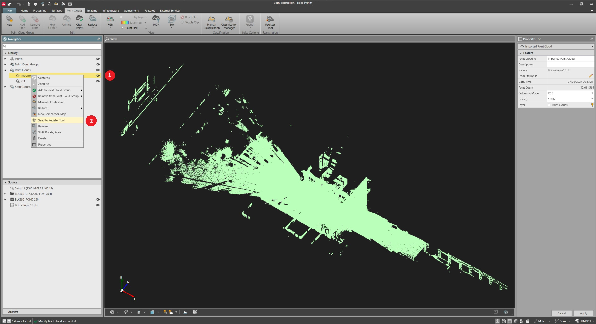
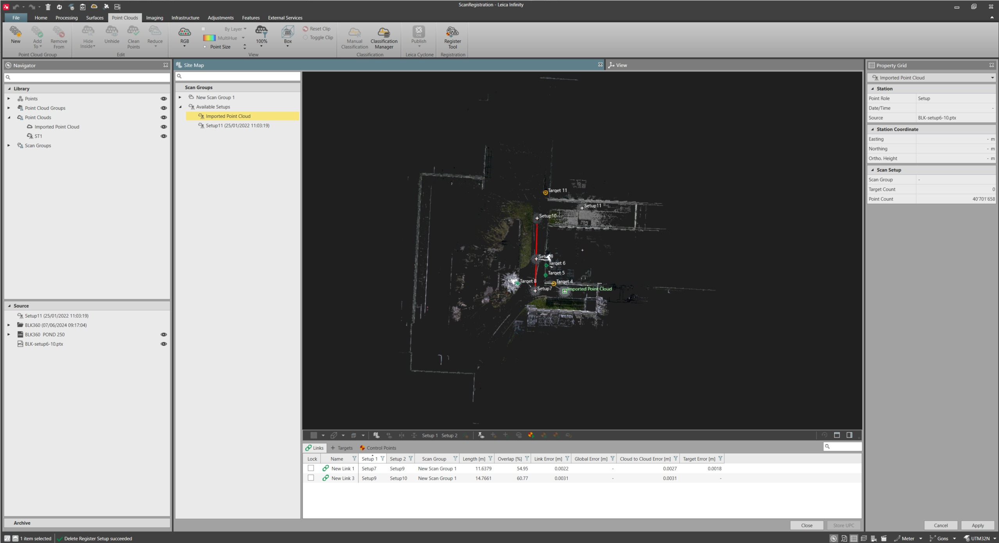

# Send Point Clouds To Register Tool

### Send Point Clouds To Register Tool

Imported point clouds can be sent to the register tool, to be aligned together with imported scan data.

To send point cloud data to the register tool:

**To send point cloud data to the register tool:**

|  |  |
| --- | --- |

| 1. | From the project Library or from the project Inspector, right-click on the point cloud to be sent to the register tool and select the Send To Register Tool from the context menu.It is not possible to send point clouds coming from image processing pipelines or from the multistation scans to the register tool.Once sent to the register tool, the point cloud data is listed under Available Setups. |
| --- | --- |

**Send To Register Tool**

It is not possible to send point clouds coming from image processing pipelines or from the multistation scans to the register tool.

Once sent to the register tool, the point cloud data is listed under Available Setups.

|  |  |
| --- | --- |

