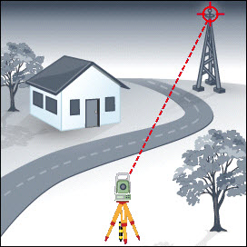
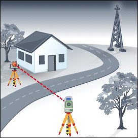
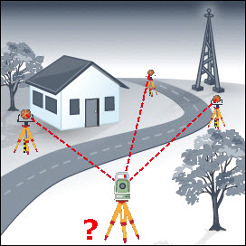
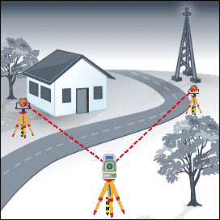
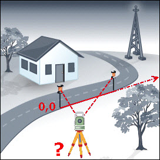
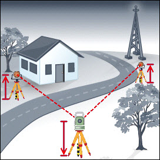

# Setup Methods

### Setup Methods

There are several methods how a setup can be calculated.

These are:

**These are:**

|  | Set Orientation:Instrument was set up on a known point and oriented to a known azimuth. |
| --- | --- |
|  | Known Backsight:Instrument was set up on a known point and oriented to a known backsight point. |
|  | Resection/Resection Helmert:Instrument was set up on an unknown point. Station coordinates and the orientation were calculated by measuring to known target points. |
|  | Multiple Backsights:Instrument was set up on a known point. The Orientation and/or height were calculated by measuring to known target points. |
|  | Local Resection:Station coordinates and Orientation were derived from measuring to two points which define a local coordinate system. |
|  | Height Transfer:Instrument was set up on a known point. The height was calculated by measuring to known target points. |

**Set Orientation:**

**Known Backsight:**

**Resection/Resection Helmert:**

**Multiple Backsights:**

**Local Resection:**

**Height Transfer:**

