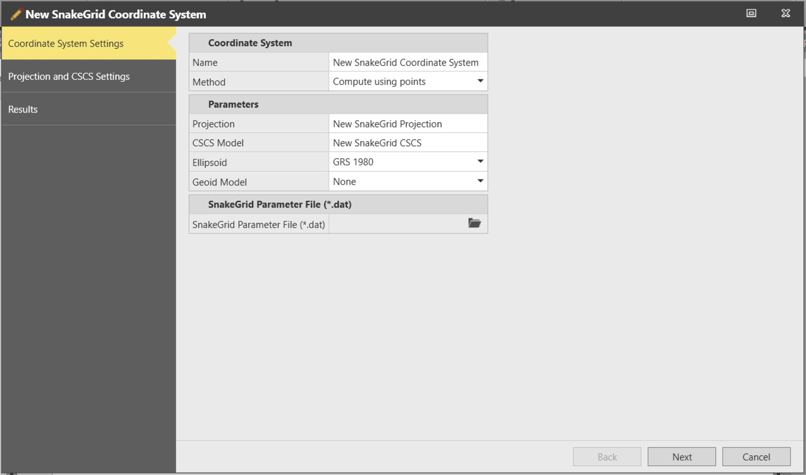
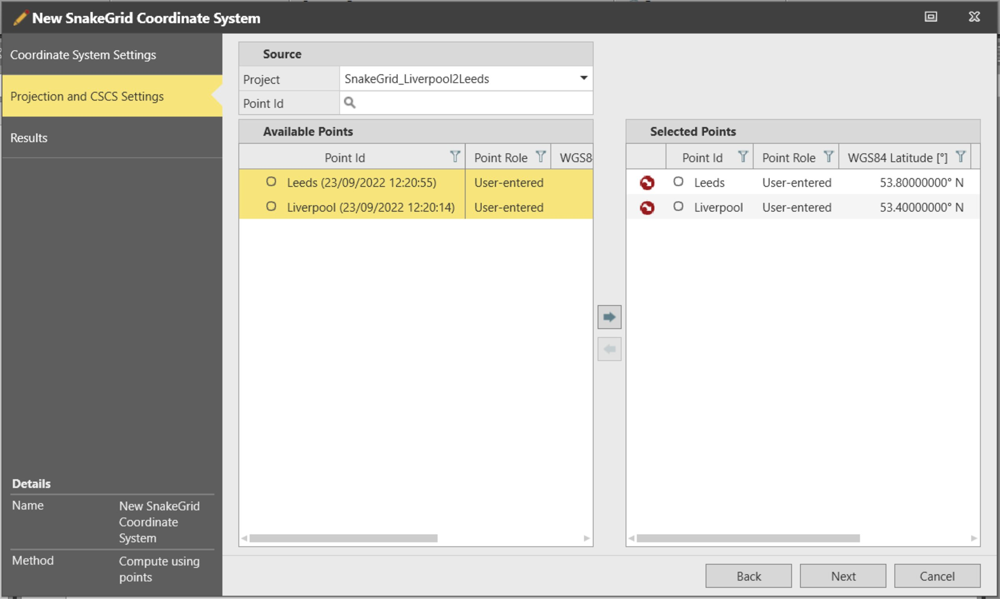
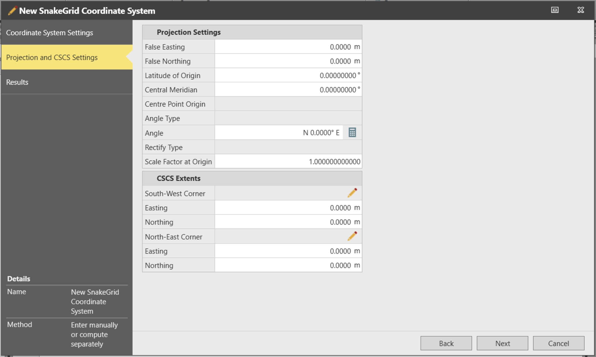
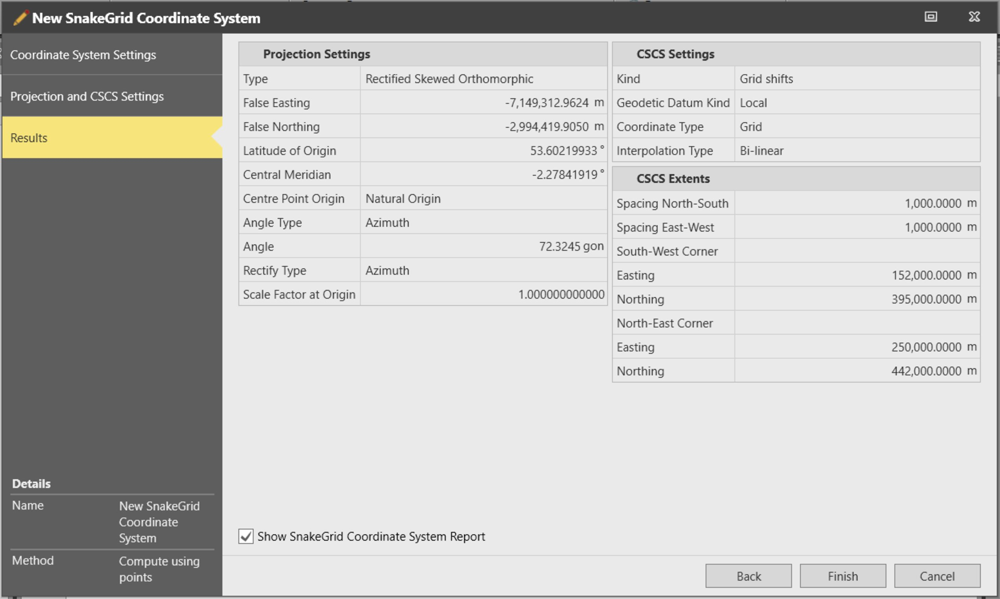

# SnakeGrid Coordinate System

### SnakeGrid Coordinate System

Using the SnakeGrid Coordinate System tool it is possible to create a low-distortion coordinate system. The resulting coordinate system consists of an ellipsoid, a projection, a CSCS file and requires a SnakeGrid parameter file (.dat). The SnakeGrid parameter file describes the characteristics of a particular project. The parameter file is created for the project by SnakeGrid using a proprietary design tool and must be available to create a coordinate system using the SnakeGrid Coordinate System tool.

How to create a SnakeGrid Coordinate System:

**How to create a SnakeGrid Coordinate System:**

| 1. | Open the SnakeGrid Coordinate System tool. |
| --- | --- |
| 2. | Enter a name for the newly created Coordinate System, Projection and CSCS Model. |
| 3. | Select the ellipsoid to be used in the newly created SnakeGrid Coordinate System.The ellipsoid selected must correspond to the one used to create the SnakeGrid parameter file (.dat). |
| 4. | Select the specific parameter file (.dat), provided by SnakeGrid. |
| 5. | Select the method that is going to be applied to create the SnakeGrid Coordinate System:Compute using points.Enter manually or compute separately. |

**SnakeGrid Coordinate System**

The ellipsoid selected must correspond to the one used to create the SnakeGrid parameter file (.dat).

- **Compute using points**.
- **Enter manually or compute separately**.

|  |  |
| --- | --- |

To create a SnakeGrid coordinate system using the method Compute using points, select the points you want to use in the computation from the left in Available Points. Move the points to the right    in Selected Points.

**Compute using points**

**Available Points**

**Selected Points**

The points can be selected from any project.

|  |  |
| --- | --- |

Alternatively, if the parameters defining the projection and the CSCS are known, these can be entered manually.

|  |  |
| --- | --- |

Finally, the tool summarises the values of the parameters and settings used to create the coordinate system.

|  |  |
| --- | --- |

Select Finish to create the SnakeGrid coordinate system and to close the wizard.

**Finish**

