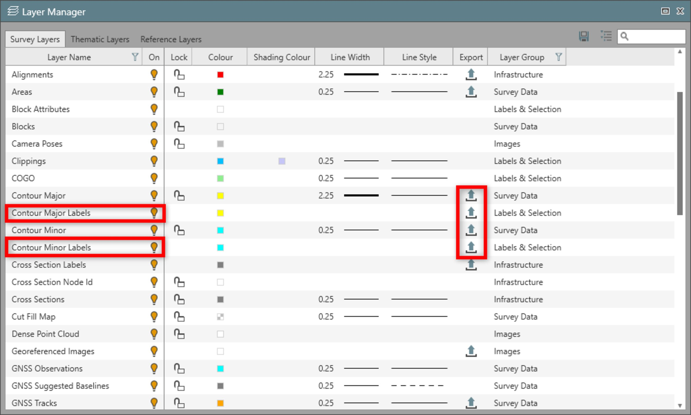

# Surface Contours

### Surface Contours

It is possible to create contours for a selected surface.

- Select a **surface**.
- From the ribbon bar, select **Contour**.
- From the Create Contour window, edit the settings to define the contour display.

Create Contour

**Create Contour**

When creating a set of contours for a surface the following settings must be considered:

**When creating a set of contours for a surface the following settings must be considered:**

Surface

**Surface**

- Displays the selected surface including the height details.

Contours

**Contours**

Set the values to determine the drawing of the contour:

**Set the values to determine the drawing of the contour:**

- **Minor Interval**, defines the distance between minor contours that are drawn.
- **Major Frequency**, defines when the major contour is drawn. Usually this setting would be set at 5 or 10.

With a minor interval of 10 and a major frequency of 5, the contours are draw every 10 metres but at every 50 metres a major contour line is drawn.

- **Min. Length**, defines the minimum contour line length to be displayed. Any shorter lines are not displayed.
- **Smoothing**, allows the contour lines to be smoothed with different intensity values.

Contour Styling

**Contour Styling**

- Define the line style and colour settings.

Contour Labels

**Contour Labels**

To display the labels, you must switch them on in the Layer Manager.

Exporting Contours

**Exporting Contours**

Contours can be exported to DXF/DWG and to XML.

Set the export flag in Layer Manager to determine if the contours are written to the DXF/DWG file.

|  |  |
| --- | --- |

