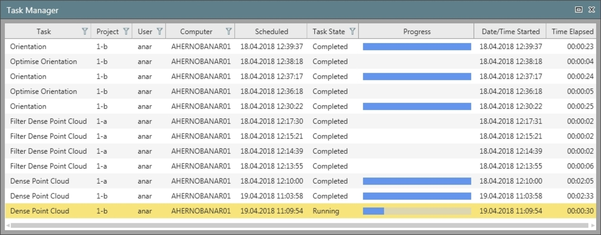

# Task Manager

### Task Manager

The task manager is launched from the quick access bar. Here you can see all processed tasks, in progress or to be processed when using a worker host machine.

|  |  |
| --- | --- |

Once you start processing a task, it runs in the background. You can continue working with Infinity or even change projects and submit another task to the queue that starts as soon as the previous task ends. You can view the progress of each task in the Task Manager. If the task is finished in the meantime, the result is moved to the results pane, for you to store.

Processing tasks create an asset directory on the computer where the processing takes place. The default directory is: C:\Users\[USER]\AppData\Local\Leica Geosystems\Infinity\mvs\assets\. The default directory can be modified, as described in Imaging.

