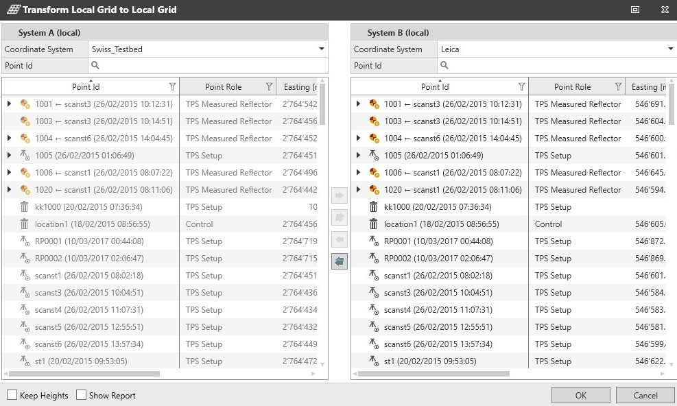

# Transform Local Grid to Local Grid

### Transform Local Grid to Local Grid

Allows you to transform the points stored with local grid coordinates of initial system A to local grid coordinates in the target system B.

To transform local grid coordinates:

**To transform local grid coordinates:**

|  |  |
| --- | --- |

| 1. | Open the Transform Local Grid to Local Grid tool. |
| --- | --- |
| 2. | Select the points you want to transform from the left pane. |
| 3. | Move the points to the right pane; a preview of the transformed coordinates is available.Infinity uses the parameters of coordinate system A to convert the Easting, Northing and Orthometric Height of each selected point to WGS84 coordinates.It then uses the parameters of coordinate system B to convert the WGS84 coordinates of each selected point to the new local Easting, Northing, Orthometric Height.Along with each TPS setup, the sideshots are also transformed.Points with no horizontal position are not transformed. |
| 4. | Enable the option to Keep Heights.If the option Keep Heights is enabled, the point heights are not transformed in system B, even though the new heights are displayed in the preview. |
| 5. | Enable the option to generate the report.You can create a report that has the transformed points. In the Results section of the report, the WGS84 coordinates of the points are also displayed. |
| 6. | Select OK.The coordinate system B is automatically set as the Master, to ensure that the projects GNSS data (if any) fits into the transformed points. |

**Transform Local Grid to Local Grid**

Infinity uses the parameters of coordinate system A to convert the Easting, Northing and Orthometric Height of each selected point to WGS84 coordinates.

It then uses the parameters of coordinate system B to convert the WGS84 coordinates of each selected point to the new local Easting, Northing, Orthometric Height.

Along with each TPS setup, the sideshots are also transformed.

Points with no horizontal position are not transformed.

**Keep Heights**

If the option Keep Heights is enabled, the point heights are not transformed in system B, even though the new heights are displayed in the preview.

You can create a report that has the transformed points. In the Results section of the report, the WGS84 coordinates of the points are also displayed.

**OK**

The coordinate system B is automatically set as the Master, to ensure that the projects GNSS data (if any) fits into the transformed points.

