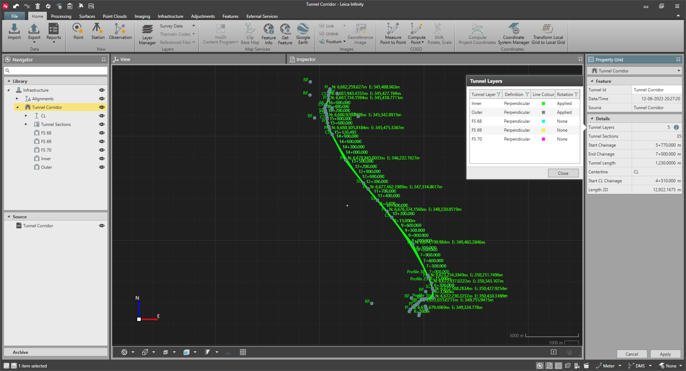

# Tunnel Layers

### Tunnel Layers

A tunnel layer represents the shape of the tunnel for a certain material or construction phase (for example, the initial cut or the final concrete layer). The tunnel shape is defined by the tunnel profiles with rotations being assigned at different chainages along the tunnel alignment.

A tunnel design can have one or multiple tunnel layers which are imported and stored together with the tunnel object, or they can be created in Infinity.

Different styling can be assigned to each individual tunnel layer.

|  |  |
| --- | --- |

### Create a New Tunnel Layer

| 1. | Select the Tunnel to which you want to add a layer. |
| --- | --- |
| 2. | Select    Tunnel Layer from the Infrastructure tab in the ribbon or right-click on the selected tunnel and select New Tunnel Layer. |
|  | A new tab opens next to the property grid where its name and style can be defined. |

**Tunnel Layer**

**New Tunnel Layer**

Tunnel layers can be defined in two ways:

**Tunnel layers can be defined in two ways:**

- Vertical: In the tunnel field application, when staking and checking tunnel profiles, these profiles are considered to follow the Z axis of the local grid coordinate system.
- Perpendicular: In the tunnel field application, when staking and checking tunnel profiles, these profiles are considered to follow a Z axis that is perpendicular to the tunnel alignment grade at the measured chainage.

Independent of the set tunnel layer definition, tunnel profiles are always represented as vertical in the project view.

Depending on the tunnel field application version, it would be possible to redefine the tunnel layer definition onboard.

Tunnel layers can be rotated by assigning Tunnel Rotations to it. Rotations determine how the profiles are rotated to accommodate the tunnel design on the curves.

### Delete a Tunnel Layer

A tunnel layer can be deleted either from the navigator or the inspector. It is only possible when the tunnel is not being edited in the Infrastructure Tool. Deleting a tunnel layer works as follows:

