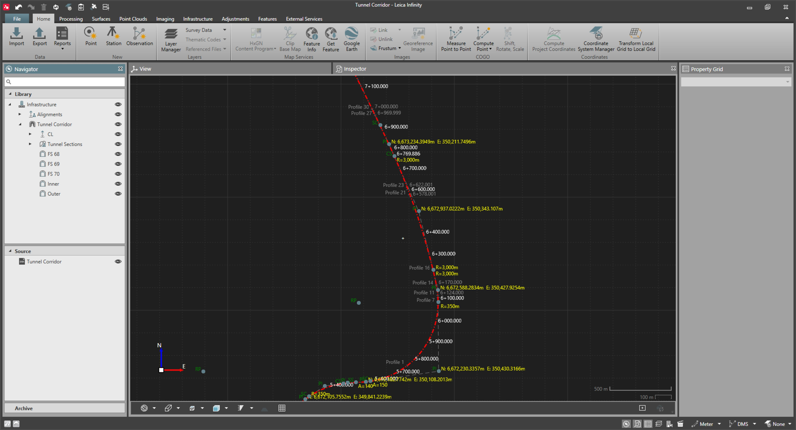

# Tunnel Objects

### Tunnel Objects

Tunnel objects are based on tunnel profiles that are assigned to different locations along a 3D alignment. Together, they define the complete tunnel design.

Tunnel objects can be created in Infinity, imported from DBX tunnel jobs or from XML files.

Tunnel objects can be exported to DBX to be used in the tunnel field application.

Example:

**Example:**

|  |  |
| --- | --- |

### Create a New Tunnel Object

| 1. | Select    Tunnel from the Infrastructure ribbon tab. |
| --- | --- |
| 2. | In the New Tunnel property window, enter the Tunnel ID. |
| 3. | Select    Edit to assign an alignment.An alignment must be defined to save the new tunnel. |
|  | The new tunnel object is added to the list in the Navigator and Inspector. |

**Tunnel**

**Edit**

An alignment must be defined to save the new tunnel.

### Edit a Tunnel Object

| 1. | From the Infrastructure ribbon tab, you can select a tunnel from the Infrastructure Tool, choosing the tunnel you want to open. |
| --- | --- |
| 2. | Or select the tunnel you want to open, right-click on the tunnel object and select    Edit from the context menu. |
|  | When you delete a tunnel object from the project it deletes the tunnel and all defined layers, profiles and rotation tables of that tunnel. The centreline alignment is not deleted. |

**Edit**

### Copy a Tunnel Object

Copying a tunnel object allows the creation of a smaller sized copy of a tunnel. This is useful when you have large tunnel designs, but are only working with a smaller segment of the tunnel in the field. A copy of the original tunnel is created by specifying a different start and end chainage that form a shorter part of the overall tunnel.

| 1. | Select the tunnel you want to copy. |
| --- | --- |
| 2. | From the Infrastructure tab in the ribbon bar or the context menu (right-click), select    Copy Tunnel. |
|  | Copy Tunnel is not available if the tunnel is being edited in the Infrastructure Tool. |
| 3. | Specify a start and end chainage in the New Tunnel page. |
| 4. | Select Create to create the copy. |

**Copy Tunnel**

**Create**

You can enter start and end chainage that does not coincide with tunnel section ends in the original tunnel. In this case, the entire tunnel section on the ends from the original tunnel is copied.

