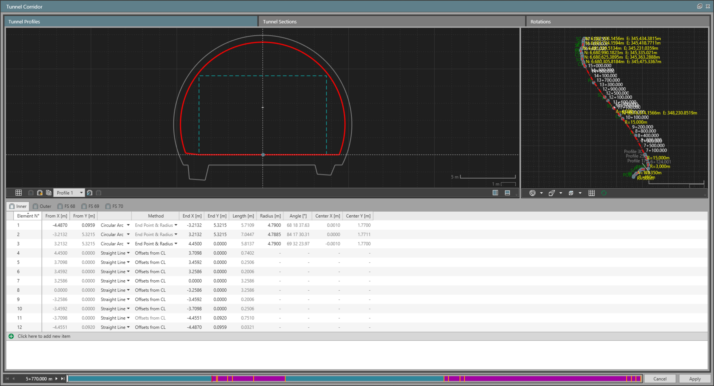
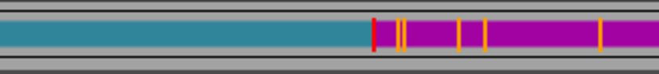
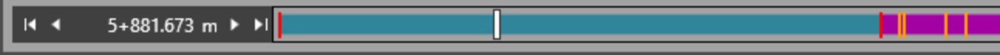
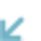
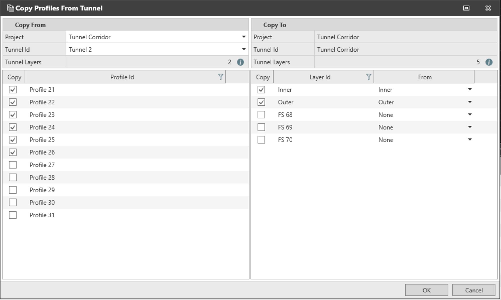
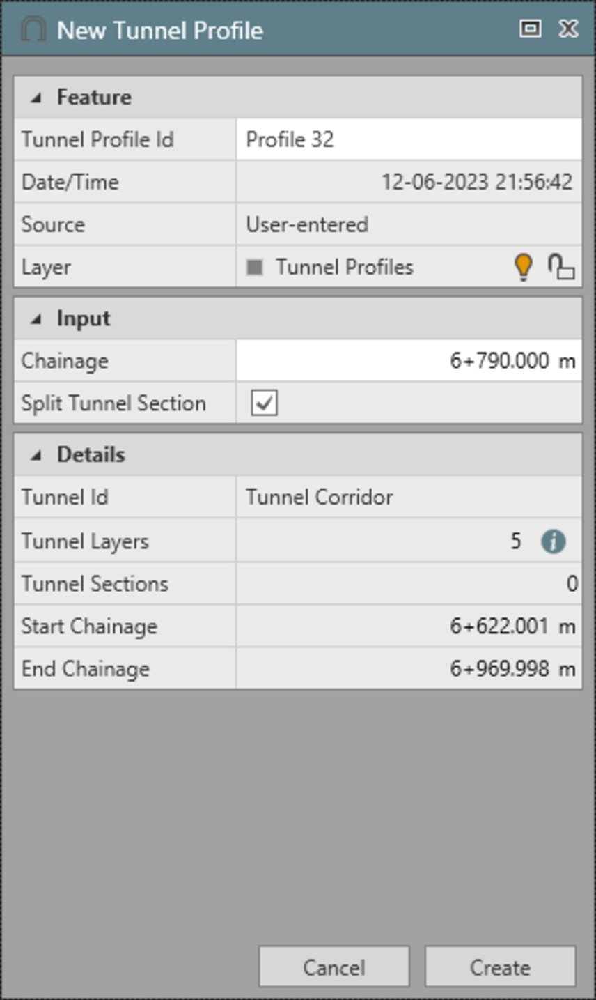

# Tunnel Profiles

### Tunnel Profiles

When opening the infrastructure manager for editing a tunnel, the tool is shown in tunnel mode.

The first page tab is selected and it is dedicated to the display of tunnel profiles.

|  |  |
| --- | --- |

The page tab is divided into the following areas:

- Profile view where the working tunnel profile is displayed.
- The profile elements table that is separated by page tabs, one per tunnel layer, and displaying the list of elements of each layer for the selected tunnel profile.
- 3D view where the tunnel, profiles and the alignment are displayed.
- The chainage bar representing the horizontal alignment from start to end and the locations where the tunnel profiles are assigned along the alignment.

To select a profile, choose from the list of profiles saved for this tunnel. The selected profile can then be edited.

From the profile shown in the profile view, you can view the different layers by choosing one of the page tabs. For the selected layer, the elements are listed and shown as highlighted in red, both in the profile view and the 3D view.

Additionally, the chainage bar indicates in red (vertical line) where the selected profile is assigned along the tunnel.

|  |  |
| --- | --- |

Tunnel profiles can be open (ending node does not match the starting node of the definition) or closed (ending node matches the starting node of the definition).

Tunnel profiles can be defined in a clockwise or an anticlockwise direction. However, each tunnel layer of all the tunnel profiles in the same tunnel must be defined following the same direction.

The 3D view represents an overall view of the tunnel currently being edited in the infrastructure manager. Use the 3D view to navigate along the tunnel or to a desired profile.

The chainage bar represents the horizontal alignment from start to end by default. But, the scale of the representation can be modified by using the mouse wheel over the bar. In doing so, its extents are modified to display the starting and ending chainages of the tunnel.

The locations where the tunnel profiles are assigned along the alignment are defined with vertical lines.

|  |  |
| --- | --- |

- White line refers to the current chainage.
- Orange lines are the chainages where all the profiles are assigned along the alignment.
- Red lines are the chainages where the working profile is assigned.

Use the icons around the current chainage to move to previous/next or first/last chainage where a tunnel profile is assigned.

Use    Load profile closest to current chainage, to find and load the tunnel profile that is assigned closest to the current chainage in the chainage bar.

**Load profile closest to current chainage**

See also:

**See also:**

Tunnel Sections

### Create a New Tunnel Profile

| 1. | Select    New Tunnel Profile from the view strip. |
| --- | --- |
| 2. | Select Create in the New Tunnel Profile tab next to the property grid. |
|  | Once the profile is created, it is added to the list of profiles in the Infra Tool and set as the working profile. |

**New Tunnel Profile**

**Create**

### Copy Tunnel Profiles

Tunnel profiles can be copied from another tunnel to the working tunnel by selecting    Copy Tunnel Profile from the view strip or    from the infrastructure tab in the ribbon.

| 1. | In the Copy Profiles From Tunnel window, select the project where the tunnel you are copying profiles from is located.This can be the project you are currently working on. |
| --- | --- |
| 2. | Select the tunnel that has the profiles to be copied. |
| 3. | Select the profiles to copy. |
| 4. | Select the tunnel layers to copy. |
| 5. | Select OK to finish copying the profiles. |

**Copy Profiles From Tunnel**

This can be the project you are currently working on.

**OK**

|  |  |
| --- | --- |

When copying profiles, tunnel layers must be matched between the two tunnels, the one you are copying from and the one you are copying to. This is done automatically if the layer names are the same between the two tunnels. When the layer names are different, you must manually match them up.

If there are conflicts in the ID of the profiles between the two tunnels, the ones being copied are renamed.

### Extract a Tunnel Profile

You can extract a profile in a transition section. The extracted profile is interpolated between the start and end profile of the section. To extract a tunnel profile:

| 1. | Slide the current chainage slider to the desired chainage or enter a chainage value next to the chainage bar. |
| --- | --- |
| 2. | Select    Extract Tunnel Profile from the view strip. |
|  | Extract tunnel profile becomes available only when:Current chainage is on an interpolated section, as in, the section where the start and end profiles are different.Current chainage is not at the start or end of a section. |
| 3. | Confirm the chainage value in the New Tunnel Profile window. |

**Extract Tunnel Profile**

- Current chainage is on an interpolated section, as in, the section where the start and end profiles are different.
- Current chainage is not at the start or end of a section.

|  |  |
| --- | --- |

You can also split the tunnel section at this chainage. This would create two sections out of one with the extracted profile assigned at the split chainage.

### Delete a Tunnel Profile

You can delete a profile by opening the list and selecting    Delete. Delete is only available when a profile is not assigned to a tunnel section.

**Delete**

### Add New Tunnel Profile Elements to the Active Tunnel Layer

| 1. | Select the working profile from the list. |
| --- | --- |
| 2. | Select the tunnel layer tab to make it active. |
| 3. | Select    in the table to add the first element. |
| 4. | Change its From and End point coordinates as required. |

An element must be one of two types:

- Straight line.
- Circular arc.

A straight line only needs start and end coordinates.

A circular arc can be defined by either of the following methods. Based on the method selected, those fields become editable while others become read-only.

- End point & radius.
- End point & centre point.
- Angle & centre point.

Switching between different arc methods does not change the parameters. To flip the direction of the arc, clockwise compared to anticlockwise, change the sign of the arc radius. A positive radius makes the arc go in a clockwise direction whereas a negative radius makes it go anticlockwise.

An arc can only span a maximum of 180° (200 gons). For arcs going over 180°, they must be split and entered as multiple consecutive arcs.

The end point of an element is always the start point of the next element.

As you modify a profile by adding, editing or removing elements, the 2D cross section view is updated in parallel. However, the 3D view remains unchanged. To see the changes made in the 3D view, you can do either of the following:

| 1. | Select    Update Profile in 3D View from the view strip. |
| --- | --- |
| 2. | Switch to any other tab or window, say tunnel sections. |

**Update Profile in 3D View**

### Mirror Elements of a Tunnel Profile

If elements are symmetric around the vertical axis, you can add elements on one side of the vertical axis, left or right. Use    Mirror Tunnel Profile Elements to add the rest automatically on the opposite side. Mirror is only available when:

**Mirror Tunnel Profile Elements**

Mirroring always results in a closed shape.

