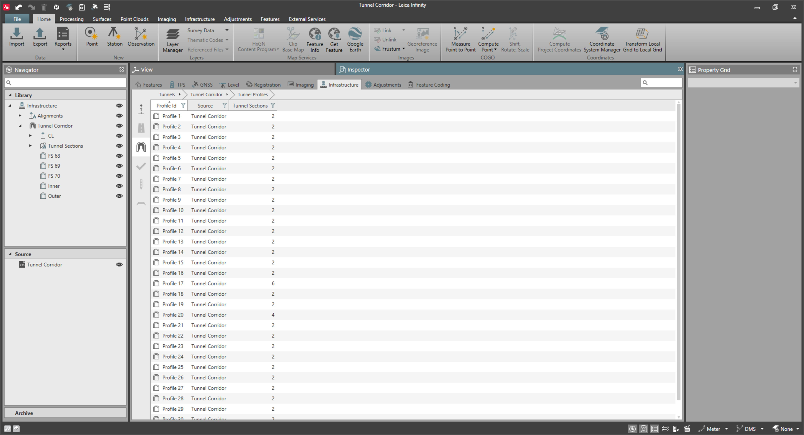
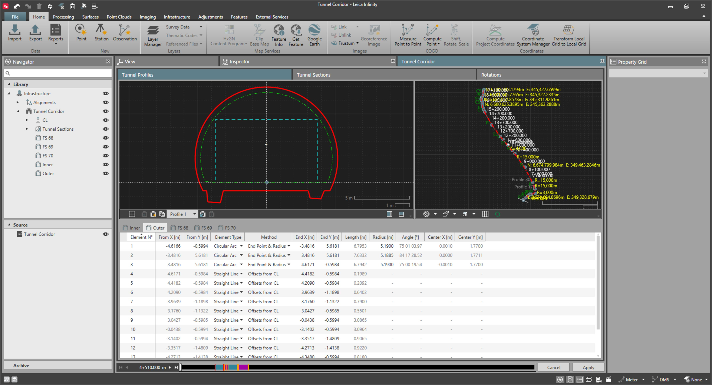

# Tunnel Profiles

### Tunnel Profiles

A tunnel profile defines the geometric shapes of the different tunnel layers at a specified chainage along the tunnel alignment.

A tunnel design has one or multiple tunnel profiles which are imported and stored together with the tunnel object, or they can be created in Infinity. A tunnel profile can be assigned at multiple chainages along the tunnel alignment.

|  |  |
| --- | --- |

Tunnel profiles can be:

- Closed: The starting node of the first element is equal to the ending node of the last element of the profile.
- Open: The starting node of the first element is not equal to the ending node of the last element of the profile.

### Profile Elements

Profile elements define the shape for the tunnel profile.

Profile elements can be:

- Straight segments.
- Circular arcs.

The coordinates of the starting and ending nodes of each profile element are referenced from the centreline. They define the horizontal and vertical offset of each node with respect to the centreline.

|  |  |
| --- | --- |

Profile elements must be defined in a clockwise or an anticlockwise direction, and they are sequentially numbered. The coordinates of an ending node of a given profile element are the same as the coordinates of the starting node of the next profile element.

See also:

**See also:**

Add New Tunnel Profile Elements to the Active Tunnel Layer

