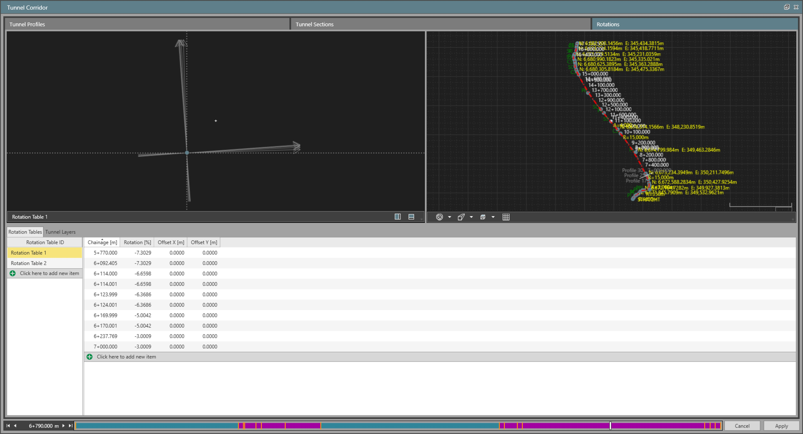
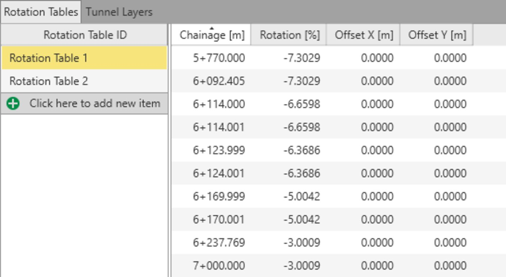

# Tunnel Rotations

### Tunnel Rotations

Rotation tables are associated to tunnel layers. They define the superelevation to be applied on the tunnel, generally due to the superelevation to be applied on the road or rail platforms travelling within the tunnel.

|  |  |
| --- | --- |

The page tab is divided in the following areas:

- The parametric table is separated on two different tabs:The Rotation Tables tab, showing the list of available tables and the list of rotation values.The Tunnel Layers tab, where the assignment between the rotation table and the layers is done.
- The Rotation Tables tab, showing the list of available tables and the list of rotation values.
- The Tunnel Layers tab, where the assignment between the rotation table and the layers is done.
- The Cross Section View where the active rotation table is displayed.
- The 3D View where the tunnel and its alignment are displayed.
- The Chainage Bar representing the horizontal alignment from start to end and the locations where the tunnel profiles are assigned along the alignment.

- The Rotation Tables tab, showing the list of available tables and the list of rotation values.
- The Tunnel Layers tab, where the assignment between the rotation table and the layers is done.

The parametric table is divided into two areas: Rotation Tables page and Tunnel Layers page.

- Rotation Tables display the list of available rotation tables. By selecting one of them, the content of the table is listed on the right part of the parametric table. Each rotation table can have one or multiple rotation values. These can be applied to the layers on the fly during the staking or checking of the tunnels in the field application to any given chainage/station. Rotation point for the profile rotations is by default applied on the centreline node, but it is possible to apply horizontal and vertical offsets to decouple these rotations from the origin.

See the rotation units section in Info & Settings > Infrastructure.

|  |  |
| --- | --- |

- Tunnel Layers allow you to establish the relationship between the tunnel layers and the existing rotation tables. Tunnel layers are listed and it is possible to select which one of the available rotation tables should be assigned to the corresponding layer. “Apply” defines a flag in the stored tunnel job to conclude if the rotations are to be applied or not during the onboard staking/check.

|  |  |
| --- | --- |

The Cross Section View is a graphical representation of the different values within the active rotation table that provides a quick overview of how the rotations are applied to the design. All rotations within the same table are displayed together within the view. Selected rotations in the table are highlighted in the cross section view.

### Create a Rotation Table and Add Values

To create a new rotation table, select    in the rotation table list. To add rotation points in a table, select the rotation table to the left and select    in the table.

Ensure to assign the rotation tables in the tunnel layers page after.

### Delete a Rotation Table

A rotation table can only be deleted if it is not assigned to a tunnel layer. You can check this by switching to the tunnel layers page and setting the rotation table assigned to a layer to either none or another rotation table.

