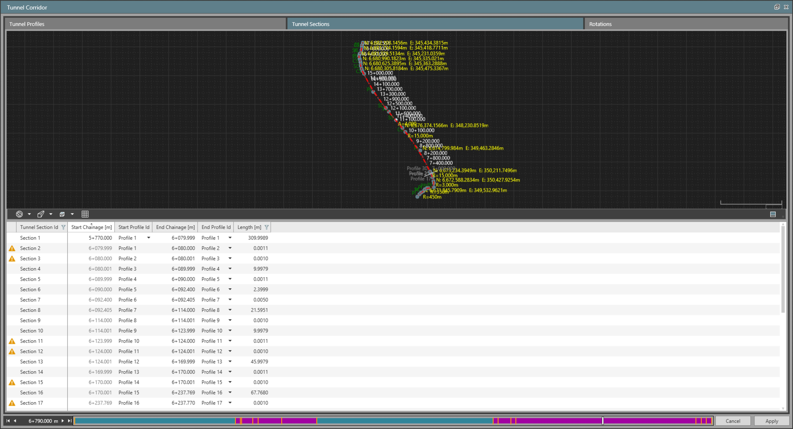
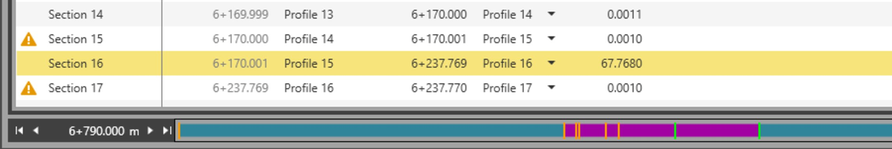

# Tunnel Sections

### Tunnel Sections

A tunnel section is defined by two profiles assigned to a start chainage and end chainage. Tunnel sections can be of different lengths depending on where profiles are assigned.

|  |  |
| --- | --- |

The page tab is divided in the following areas:

- The Sections Table listing the existing tunnel sections.
- The 3D View where the tunnel and its alignment are displayed.
- The Chainage Bar representing the horizontal alignment from start to end and the locations where the tunnel profiles are assigned along the alignment.

The Sections Table displays the list of tunnel sections that indicate the profile assignments used with the tunnel. A section represents the start and end tunnel profiles and the chainages they are assigned at. Start profile and chainage of a section is fixed to be the end tunnel profile and chainage of the previous tunnel section (except for the first Tunnel Section).

The 3D View represents the overall tunnel currently being edited in the infrastructure manager, including tunnel alignment and the currently assigned tunnel profiles along the alignment.

The Chainage Bar represents the same information as in the tunnel profiles page tab, except it shows the selected tunnel section limits in a highlighted colour.

|  |  |
| --- | --- |

Additionally, the filling colour of the tunnel sections along the bar notifies if the tunnel section is:

- Non-interpolated: Represented in teal, where the same tunnel profile is used at the start and end of the tunnel section.
- Interpolated: Represented in dark magenta, where different tunnel profiles are used at the start and end of the tunnel section.

### Create a New Tunnel Section

You must have at least one tunnel profile before creating tunnel sections. To create a new tunnel section, select    in the table. By default, the end chainage is set to the end of the alignment.

You can edit the start chainage of the first section. For any subsequent section, its start chainage follows from the preceding sections end chainage. As you create sections, 3D view updates to show the assigned profiles along the alignment at the specified chainages.

A tunnel section can show a    warning or an    error icon next to it, to make you aware of potential issues. These are based on the tunnel profiles assigned on either end of the section.

A warning is raised in the following scenarios:

An error is raised when the two profiles are not defined in the same direction.

### Delete a Tunnel Section

Deleting a tunnel section does not delete the profiles. It removes the assignment of the profiles at the chainages of the deleted section. Because we cannot have gaps in tunnel sections, deletion of tunnel sections is handled as follows:

