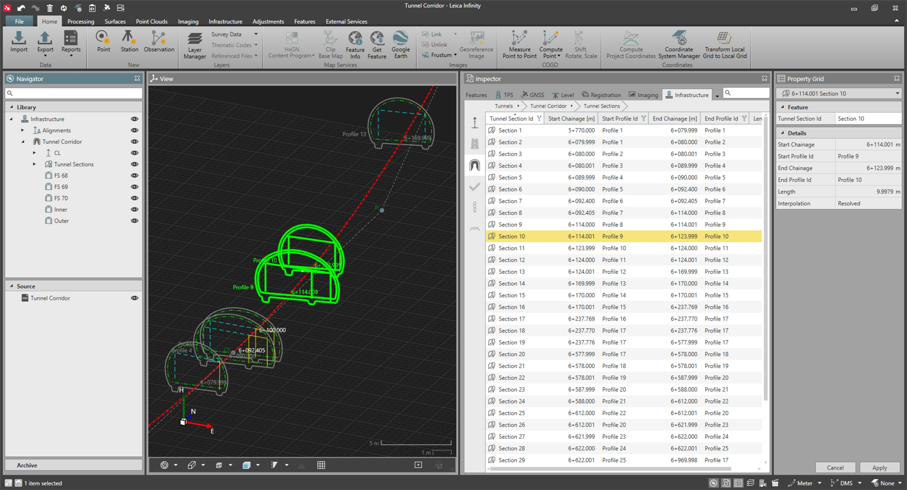

# Tunnel Sections

### Tunnel Sections

Tunnels are segmented into tunnel sections defined by a start and end profile.

- Start section: The tunnel profile assigned at a starting chainage.
- End section: The tunnel profile assigned at an ending chainage.

|  |  |
| --- | --- |

The ending profile and ending chainage of a section are always the starting profile and starting chainage of the next section, respectively.

Depending on the starting and ending profiles of the section, we differentiate between:

- Non-interpolated section: The start profile and end profile of the tunnel section have the same ID.
- Interpolated (transition) section: The start profile and end profile of the tunnel section do not have the same ID.

To have a valid section that can be interpolated, the number of profile elements in the start and end profiles of a section must match.

Intermediate tunnel profiles along an interpolated section are automatically interpolated on board the field software (linear interpolation), while running the tunnel application.

