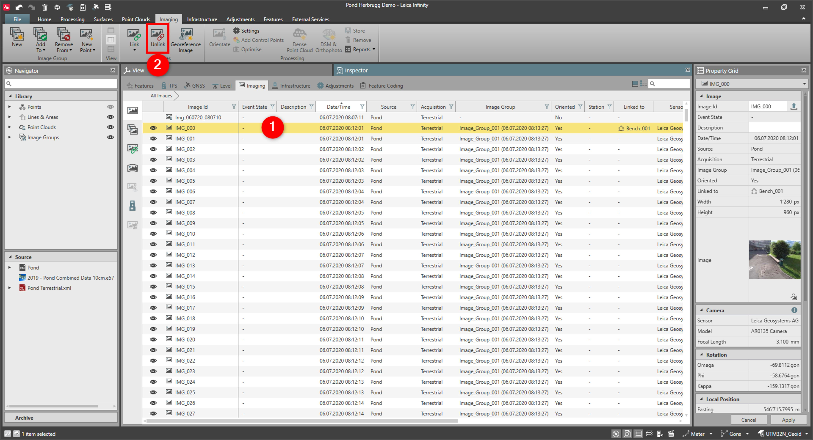

# Unlink Images

### Unlink Images

Images can manually be unlinked from points or lines or areas. They cannot manually be unlinked from point clouds.

To unlink an image from an object:

**To unlink an image from an object:**

|  |  |
| --- | --- |

| 1. | Select the linked image, either from the Inspector, Navigator or the graphical view. |
| --- | --- |
| 2. | Select Unlink from the Images ribbon bar.Alternatively select Unlink from the context menu. |

**Unlink**

**Unlink**

