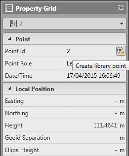
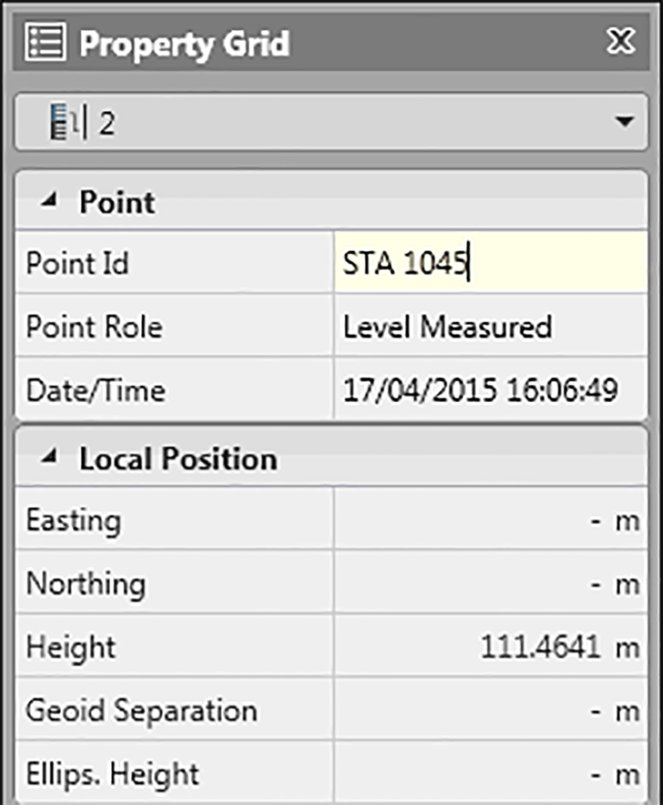

# Using Turning Points

### Using Turning Points

By default, all turning points imported with the level lines are visible in the project data, but they are not listed from the library points. In most cases, the level lines are long and if it is required to use turning points for other project data, these points can be converted to become library points.

The start, end and all Intermediate Sideshots (IS) are by default library points.

Create Library Point

**Create Library Point**

For any turning point that you want to use in the project, such as for the height of a TPS station, do the following:

**For any turning point that you want to use in the project, such as for the height of a TPS station, do the following:**

| 1. | Locate and select the point to view the data in the Property Grid. |
| --- | --- |
| 2. | Select the Create library point option in the Point ID field. |
| 3. | Select Apply. |

**Create library point**

**Apply**

Now you can see the point ID and it can be edited - If necessary, you can rename the point to use with other project data.

When converting a turning point to a library point and editing the point ID to be an existing point in the project. This level measured becomes part of the point averaging of the point.

|  |  |
| --- | --- |

