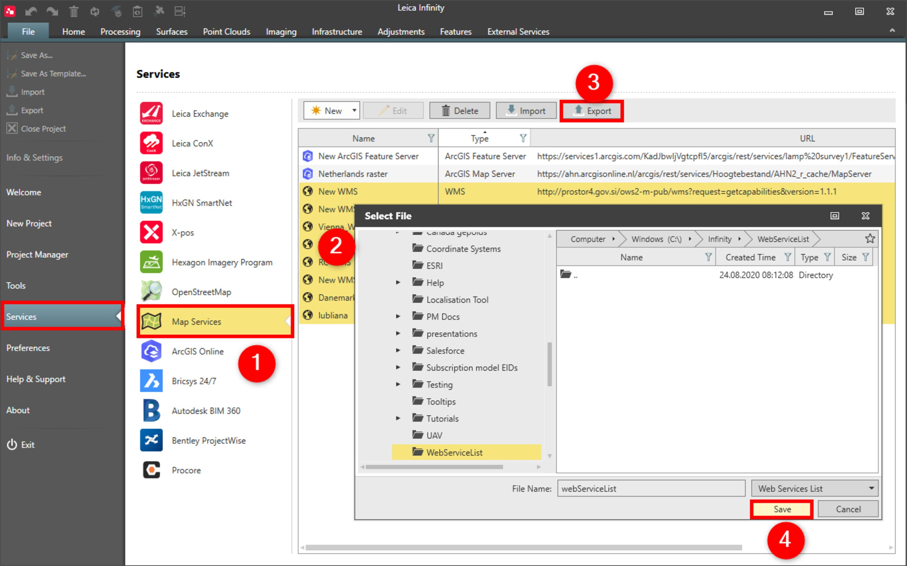

# Export

### Export

Existing WMS/WMTS/WFS services (including connection name, URL, user name) can be exported to webServiceList.fil format and then used in Captivate or by another Infinity instance.

To export selected WMS/WMTS/WFS to web service list:

**To export selected WMS/WMTS/WFS to web service list:**

|  |  |
| --- | --- |

| 1. | Select File, then Services and then Map Services from the menu. |
| --- | --- |
| 2. | Select the WMS//WMTS/WFS services you want to export. |
| 3. | Select Export. |
| 4. | Select the folder location to export to. |
| 5. | Select Save. |

**File**

**Services**

**Map Services**

**Export**

**Save**

To load the web service list in Captivate use transfer user objects.

Passwords are not exported, add them manually in Captivate or another Infinity instance.

See also:

**See also:**

Get Feature

Base Map

The video "Leica Infinity - Services - How to use the ArcGIS Online service" https://www.youtube.com/watch?v=QgFY17R990o

**"Leica Infinity - Services - How to use the ArcGIS Online service"**

