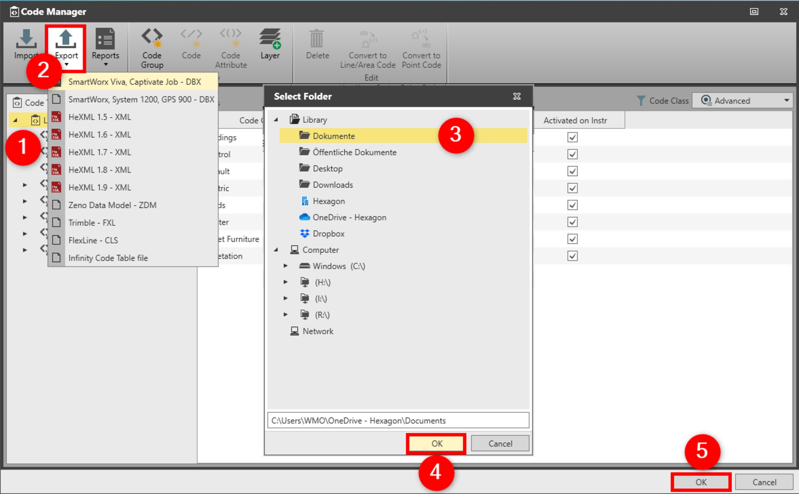

# Export

### Export

The code table content can be exported to:

**The code table content can be exported to:**

- SmartWorx Viva, Captivate Job - DBX.
- SmartWorx, System1200, GPS 900 - DBX.
- HeXML- XML.
- Zeno Data Model -ZDM.
- Trimble -FXL.
- FlexLine - CLS.
- Infinity Code Table - (*.lict).

To export a code table or codelist:

**To export a code table or codelist:**

|  |  |
| --- | --- |

| 1. | Open the Code Table that you want to export. |
| --- | --- |
| 2. | Select Export and select the format. |
| 3. | In the Select Folder window, select the location to save the file. |
| 4. | Select OK. |
| 5. | Select OK to save the changes and to close the Code Manager. |

**Export**

**OK**

**OK**

See also:

**See also:**

Code Manager

Code Tables

The video "Leica Infinity - Feature Coding Part 1 - How to create a Code Table & Codelist" https://www.youtube.com/watch?v=9Mf8E0trTXA

**"Leica Infinity - Feature Coding Part 1 - How to create a Code Table & Codelist"**

