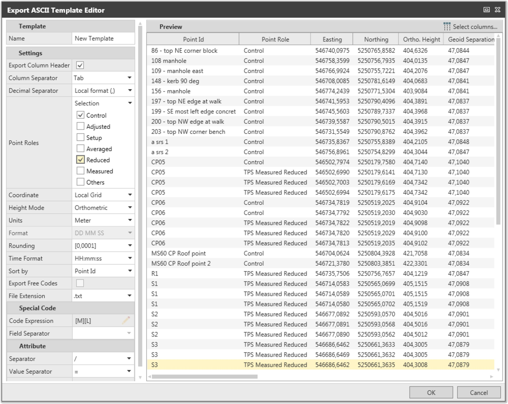
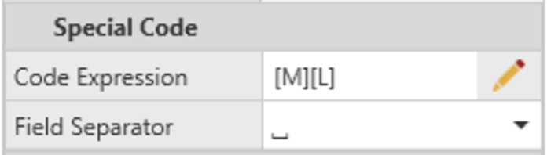
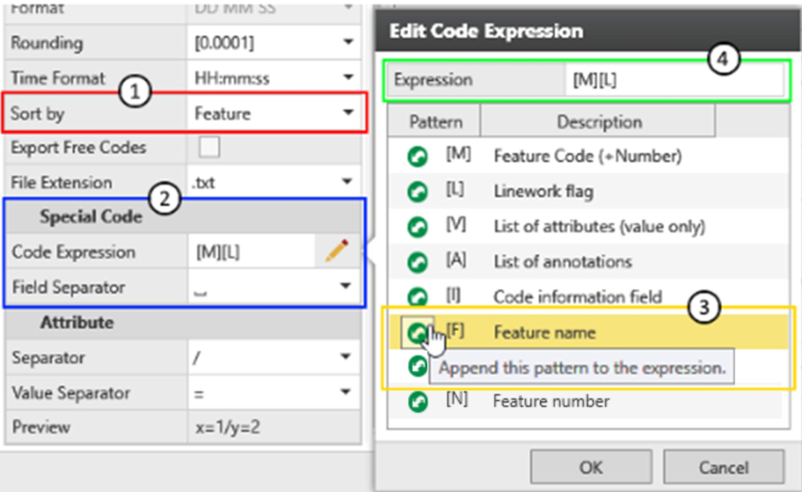
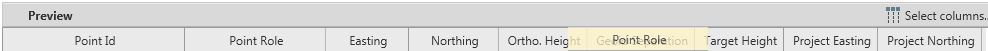
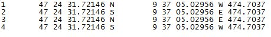
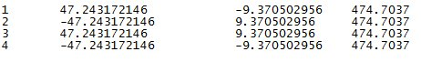

# Export ASCII Data

### Export ASCII Data

The ASCII export allows you to extract point information from your project to an ASCII file. The export format must be defined in a template. In the template you specify and store information like:

- A template name.
- ASCII specific settings.
- File content settings.

To export data to an ASCII file:

**To export data to an ASCII file:**

| 1. | Go to the File tab and select Export from the menu on the left side or go to the Home tab and select Export from the ribbon bar. |
| --- | --- |
| In the export dialog: |
| 2. | Select ASCII as the Type of source file to be exported. |
| 3. | Browse to a location where the exported file shall be written to (for example, to the drive, folder). |
| 4. | Give the file a Name. You can choose a file extension from the drop-down list or give the name any file extension you want. |
| 5. | Choose whether a subdirectory shall be created. If you tick the checkbox a subdirectory of the same name as the file is created and the file is written to it. |
| 6. | Under Settings select an existing Template that fits the file format or select New... to define a new one.Confirm a newly defined template with OK. |
| 7. | Select the Export option. |

**File**

**Export**

**Home**

**Export**

**Type**

**Name**

**subdirectory**

**created**

**Settings**

**Template**

**New...**

**OK**

**Export**

Defining a new ASCII Export template

**Defining a new ASCII Export template**

|  |  |
| --- | --- |

Settings:

**Settings:**

| Select to Export Column Headers if desired.Select the Column Separator to be used in the exported ASCII file.Select the Point Roles to be exported.Choose between Highest to export only the highest role for each point, All to export all available roles for each point or Selection to export only the selected roles.Select the type of Coordinates to be exported.Only available coordinates or coordinates that can be derived from a transformation calculation are exported.Select the Height Mode to be exported.Only the available height mode is exported or the geoid separations must be known.Set the Units for exported distances.If you intend to export geodetic coordinates, identify the coordinate format.For more information, refer to:Choose the precision for Rounding.Select whether the exported data shall be sorted by Point ID, Date/Time or Feature.Sort by Feature: It is possible to export ASCII data sorted by Feature to better support moving field collected data to third party software.If you select Sort by Date/Time, you can activate Export Free Codes by selecting the checkbox.Free codes are purely time-related information. They are recorded in between of measurements in the field. A time stamp is recorded with each free code allowing to export points and free codes in a chronological order to be used for third-party mapping software.Select the File Extension to specify the file type of the export file. |
| --- |

- Select to **Export Column Headers** if desired.
- Select the **Column Separator** to be used in the exported ASCII file.
- Select the **Point Roles** to be exported.Choose between Highest to export only the highest role for each point, All to export all available roles for each point or Selection to export only the selected roles.
- Select the type of Coordinates to be exported.

Only available coordinates or coordinates that can be derived from a transformation calculation are exported.

- Select the **Height Mode** to be exported.

Only the available height mode is exported or the geoid separations must be known.

- Set the **Units** for exported distances.
- If you intend to export geodetic coordinates, identify the coordinate format.For more information, refer to:
- Choose the precision for Rounding.
- Select whether the exported data shall be sorted by **Point ID**, Date/Time or Feature.Sort by Feature: It is possible to export ASCII data sorted by Feature to better support moving field collected data to third party software.
- If you select **Sort by Date/Time**, you can activate Export Free Codes by selecting the checkbox.Free codes are purely time-related information. They are recorded in between of measurements in the field. A time stamp is recorded with each free code allowing to export points and free codes in a chronological order to be used for third-party mapping software.
- Select the **File Extension** to specify the file type of the export file.

Special Code:

**Special Code:**

Define the output for the Code Expression, that sets how the code, attribute, code information and feature name is written in the ASCII export, including the Field Separator.

**Code Expression**

|  |  |
| --- | --- |

To define the code expression, do the following:

**To define the code expression, do the following:**

|  |  |
| --- | --- |

| 1. | In the Export ASCII Template Editor, select Sort by Feature. |
| --- | --- |
| 2. | In the Code Expression field, select the    Edit icon to open the Edit Code Expression dialog. |
| 3. | In the Edit Code Expression dialog, define the Code Expression by selecting or entering the patterns to be part of the export. |

**Export ASCII Template Editor**

**Sort by Feature**

**Code Expression**

**Edit**

**Edit Code Expression**

**Edit Code Expression**

**Code Expression**

You can write special characters in between patterns, for example [C]/[N]*[L]*[V1], then they get exported in all cases.

You can write one special character before or after the pattern, then the special character only gets exported, if the pattern itself exists, for example [C][/N][*L][*V1].

Attributes:

**Attributes:**

| Select the Attribute and the Value Separator that shall be used in the ASCII file.A preview shows you how the attribute columns are structured in the ASCII file based on your settings. |
| --- |

- Select the Attribute and the Value Separator that shall be used in the ASCII file.
- A preview shows you how the attribute columns are structured in the ASCII file based on your settings.

Preview:

**Preview:**

| The Preview shows you how the data is written to the ASCII file.Select the columns to be exported. Unchecked columns are not exported.Only data that is available according to the given ASCII settings are available for selection. |
| --- |

- The Preview shows you how the data is written to the ASCII file.Select the columns to be exported. Unchecked columns are not exported.

Only data that is available according to the given ASCII settings are available for selection.

- To change the sequence of columns in the ASCII file, shift them (by clicking and dragging them) in the Preview.

Geodetic Coordinate Formats

**Geodetic Coordinate Formats**

If you intend, to export geodetic coordinates to a text file, the coordinates can be exported in one of the following formats:

DD.DDDD.

**DD.DDDD**

With the "-" sign indicating West and South.

DD MM SS.

**DD MM SS**

With the "-" sign indicating West and South.

DD.MMSS.

**DD.MMSS**

With the "-" sign indicating West and South.

