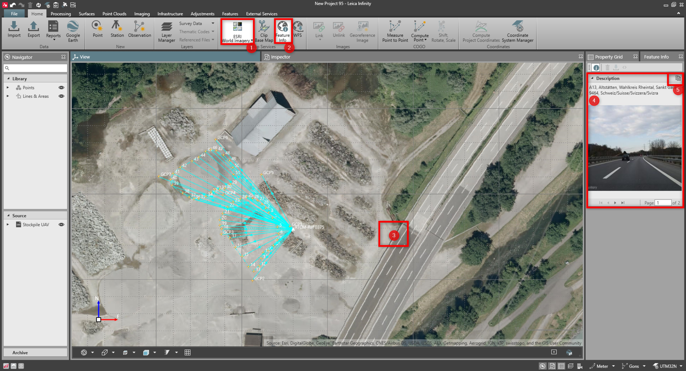
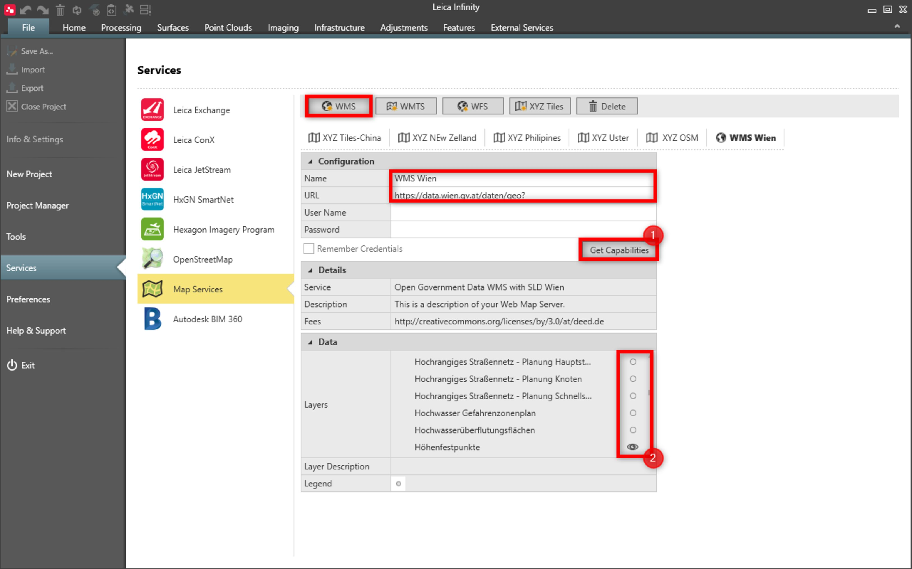
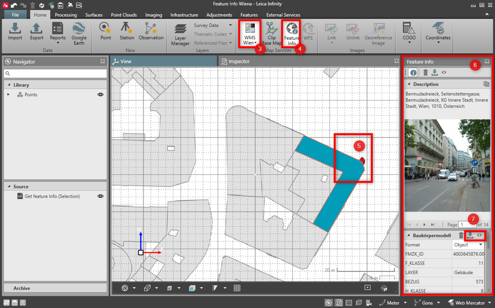

# Feature Info

### Feature Info

With the feature info it is possible to discover data directly from the base map view.

To get the basic feature info from predefined base maps:

**To get the basic feature info from predefined base maps:**

|  |  |
| --- | --- |

| 1. | Enable any of the predefined base maps. |
| --- | --- |
| 2. | From the Home tab, select the Feature Info option. |
| 3. | Click into the desired area of the displayed map. |
| 4. | Available position information, including street view images from mapillary service is displayed in the property grid. |
| 5. | Copy the active image to the library and show its position in graphical view. |

**Home**

**Feature Info**

To download feature info like attributes or geometry from user-defined web map service:

**To download feature info like attributes or geometry from user-defined web map service:**

Identifying features is done on visible web map service layers.

|  |  |
| --- | --- |
|  |  |

| 1. | In File, define the web map service which supports querying of the features.For more information, refer to File > Services > Map services. |
| --- | --- |
| 2. | In File, turn the layers on or off.If too many layers are on, the performance is affected. |
| 3. | In the project, select the defined Web Map Service as a base map. |
| 4. | Select the Feature Info option. |
| 5. | Click into the desired area of the displayed map. |
| 6. | Available position information, including images, feature geometry and attributes is displayed in the property grid. |
| 7. | Download the single feature or only the code with attributes. |

**File**

**File**

**Services**

**Map services**

**File**

**on**

**off**

If too many layers are on, the performance is affected.

**Web Map Service**

**Feature Info**

