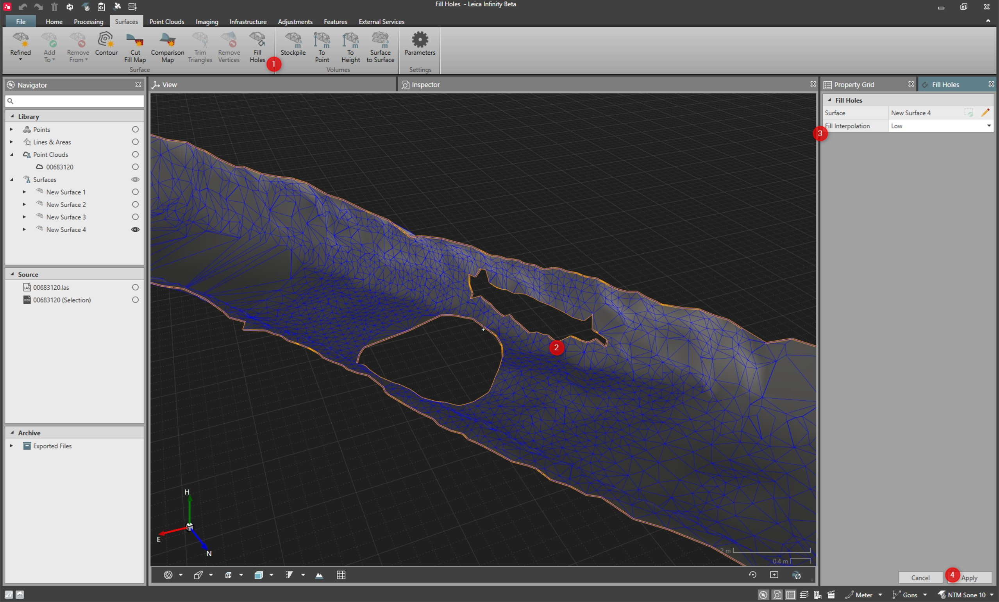

# Fill Holes

### Fill Holes

It is possible to fill holes in the surfaces when the holes in the surface are created but the surface should be continuous.

Fill holes fills the closed shape holes.

How to select the surface for the fill holes tool:

**How to select the surface for the fill holes tool:**

| 1. | Select the surface from the graphical view, the inspector or the navigator. |
| --- | --- |
| 2. | Select Fill Holes from the surface ribbon bar. |
|  | The selected surface is automatically used in the fill holes tool. |

**Fill Holes**

Alternatively:

**Alternatively:**

| 1. | Select the surface and right-click to open the context menu from the graphical view, the inspector or the navigator. |
| --- | --- |
| 2. | From the context menu, select Fill Holes. |
|  | The selected surface is automatically used in the fill holes tool. |

**Fill Holes**

Alternatively:

**Alternatively:**

| 1. | Select Fill Holes from the surface ribbon bar. |
| --- | --- |
| 2. | Select the pencil icon and then the surface from the list or select the surface in graphical view and select the Add current selection icon. |

**Fill Holes**

**pencil**

**Add current selection**

How to fill the holes:

**How to fill the holes:**

|  |  |
| --- | --- |

| 1. | Select the surface and launch the fill holes tool as explained previously. |
| --- | --- |
| 2. | Select highlighted holes edge which should be filled. |
| 3. | Select the Fill Interpolation parameter. |
| 4. | Select Apply. |

**Fill Interpolation**

**Apply**

Multiple holes can be selected in one hole filling event. The hole is filled in the same fill interpolation parameter within the same fill holes event.

Fill Interpolation Parameter

**Fill Interpolation Parameter**

This setting defines how holes in the surface are filled. The level of interpolation considers the surrounding surface geometry to determine how to fill the holes and how well to fit to the surrounding surface. With no interpolation, straight triangles between hole vertices are created, with no interpolated vertices. When applying levels of interpolation results in more vertices within the holes to be filled.

