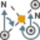
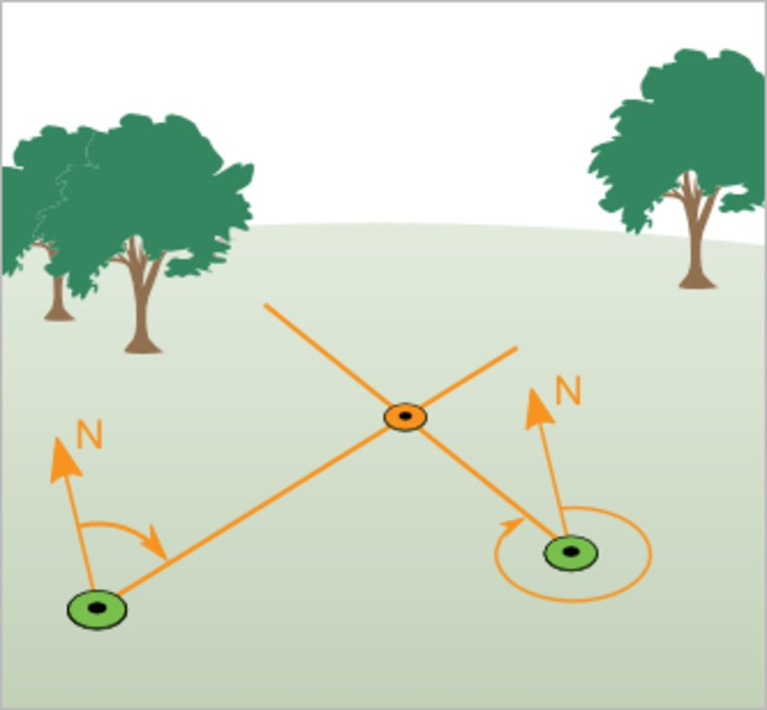
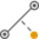
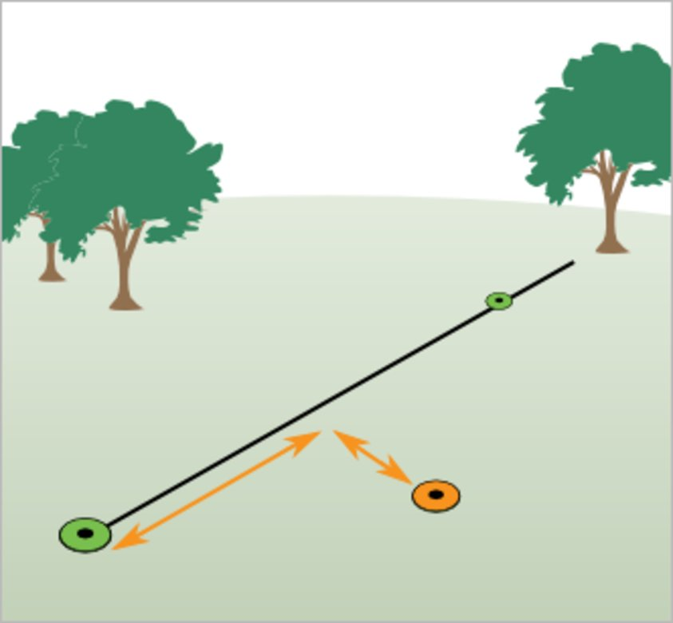
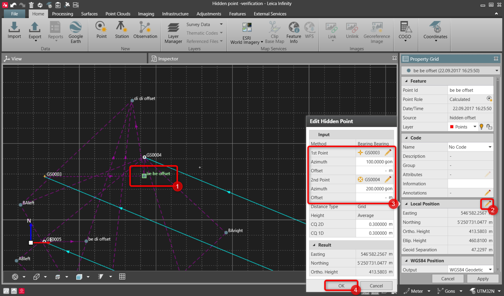

# GNSS Hidden Points

### GNSS Hidden Points

Hidden points are points that cannot be directly accessed with the GS. For example, if a point physically cannot be reached or because no satellites can be tracked in the point to be measured due to obstructions.

The hidden points can be measured in the field using Leica Captivate, Leica SmartWorx or Leica Viva.

Infinity supports importing, editing and updating these points.

The lines between the points which are used for the calculation are visualised on the hidden point survey layer.

Importing GNSS Hidden Points

**Importing GNSS Hidden Points**

The following methods are supported:

**The following methods are supported:**

| Icon | Method | Illustration | Description |
| --- | --- | --- | --- |
|  | Bearing Bearing |  | Calculates the intersection point between two selected points using defined bearings. |
|  | Distance Distance |  | Calculates the intersection points between two selected points using defined distances. |
|  | Point in Direction |  | Calculates a point using a defined direction and distance from a known point. |
|  | Line Offset Point |  | Calculates the position of an offset point using an entered distance along and a perpendicular offset from a defined line. |

Hidden points are included in the COGO report and in the data source report.

Editing GNSS hidden points:

**Editing GNSS hidden points:**

| 1. | Select a computed hidden point. |
| --- | --- |
| 2. | In Local Position, select   .A flyout displays the method and values used to compute the point.The parameters available in the flyout are the same available in the COGO report for that specific point. |
| 3. | Change the values.New coordinates of the hidden point are computed as soon as some values are changed. The new coordinates are shown in the flyout. |
| 4. | Select OK.The Property Grid is updated and new coordinates are stored. |

New coordinates of the hidden point are computed as soon as some values are changed. The new coordinates are shown in the flyout.

**OK**

The Property Grid is updated and new coordinates are stored.

Updating GNSS Hidden Points

**Updating GNSS Hidden Points**

The coordinates of a hidden point are automatically recomputed when the coordinates of a point which has been previously used in hidden point measurements are changed.

