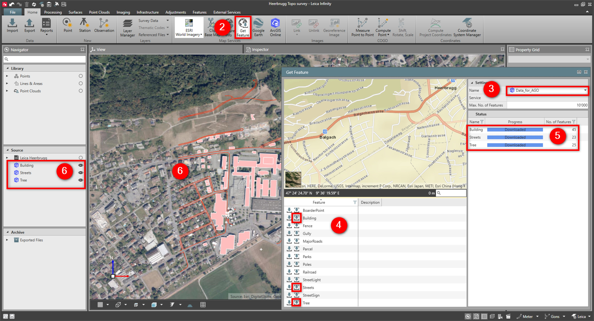

# Get Feature

### Get Feature

With the get feature it is possible to download features like points, lines, areas, together with their codes and attributes from user-defined Web Feature Service (WFS) or ArcGIS Online feature servers.

When logged in to ArcGIS Online the feature servers are added automatically to the list.

To visualise the data in Infinity, it is necessary to create/download a coordinate system.

To get features:

**To get features:**

|  |  |
| --- | --- |

| 1. | Define a WFS or ArcGIS feature server in from the File tab. Refer to Map Services. |
| --- | --- |
| 2. | To access the service within an open project, go to the Home tab > Map Services and select the Get Feature icon.The Get Feature dialog opens.The map is located around your project data by default.If the project is empty, the map is located around Heerbrugg, Switzerland by default. |
| 3. | In the Settings table, you can select the Service and the Max. No. of Features.To select the Service, select the arrow of the Name field to open a drop-down menu of available services.To select Max. No. of Features, click into the Max. No. of Features field and enter a number to limit the maximum number of features in one single download.By default, the Max. No. of Features are set to 10000. |
| 4. | To download the data, select the Download all icon or the Download current view icon.Download all: For downloading all features from the selected layer.Download current view: For downloading features from current map view only.It might happen that some services do not support the Download current view option. If no data can be downloaded, use the Download all option. |
| 5. | After starting the download, follow the download in the status section. In the status section, you can view the progress, the number of downloaded features and download errors. |
| 6. | After the download, you can see the features in your project. For selected features, you can see single attributes. From the Navigator>Source, you can open an attribute table from the context menu for all features. |

**WFS**

**ArcGIS feature server**

**Home**

**Map Services**

**Get Feature**

The map is located around your project data by default.

If the project is empty, the map is located around Heerbrugg, Switzerland by default.

**Service**

**Max. No. of Features**

**Service**

**Name**

**Max. No. of Features**

**Max. No. of Features**

By default, the Max. No. of Features are set to 10000.

**Download all**

**Download current view**

**Download all**

**Download current view**

It might happen that some services do not support the Download current view option. If no data can be downloaded, use the Download all option.

**Download all**

**Navigator**

**Source**

It is possible to select an object and run Copy from CAD. Refer to How to Copy from CAD?.

**Copy from CAD**

