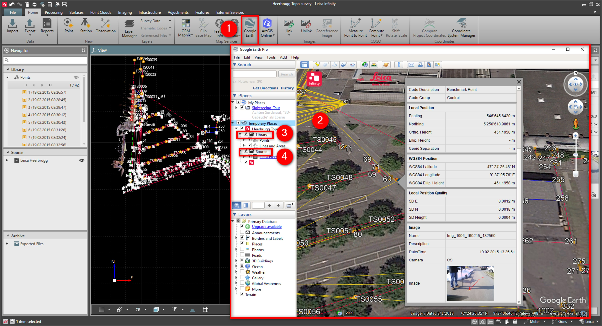

# Google Earth

### Google Earth

Infinity offers the possibility to view and inspect your project data in Google Earth.

**Requirements:**

- Google Earth is installed.
- Project data has either WGS84 coordinates or a coordinate system attached.

To visualise the data in Google Earth:

**To visualise the data in Google Earth:**

|  |  |
| --- | --- |

| 1. | Go to the Home tab and select the Google Earth option from inside the ribbon bar. |
| --- | --- |
| 2. | Google Earth is started and the data is displayed as a Temporary Place. |
| 3. | Under Library, click the links to get information on the properties of single points, lines, areas or surfaces in a Google Earth flyout. |
| 4. | Under Source, click the links to get information on the properties of single data sources in a Google Earth flyout. |

**Home**

**Google Earth**

**Library**

**Source**

By default you see all GNSS and TPS observations as well as the point symbols and point ID, each on a separate layer:

To switch off a layer in Google Earth deselect it in the tree structure on the left.

**deselect**

To synchronise Google Earth with Infinity:

**To synchronise Google Earth with Infinity:**

| 1. | Turn on    the Google Earth view synchronisation. |
| --- | --- |
| 2. | Google Earth then follows all zoom, pan and rotation operations you make in Infinity. |

