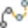
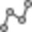
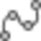
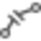

# How to Edit the Feature Geometry?

### How to Edit the Feature Geometry?

The functionality to edit features is available from within the context menu in the graphical view.

To edit features through the ribbon bar go to the Features tab. Activate the feature to be edited by selecting it.

**Features**

To indicate that feature editing is on, the cursor appears as a cross hair during all edit operations.

| Icon | Function | Description |
| --- | --- | --- |
|  | Add point at Start/End of a Line | You can choose to add points either at the start or the end of a line or spline. Click the points to be added. When you are done, right-click and select End from the context menu or select Create in the property grid. |
|  | Add point in Between | You can choose to add points in between. Right-click the segment where additional points shall be inserted and select Add Point, then in Between. The existing segment is removed. When you are done, right-click and select End from the context menu or select Create in the property grid.In Between, is only available through the context menu. |
|  | Remove | You can remove points from a feature. Select the feature and click the point to be removed.In order to remove a point through the context menu, select the point and not the feature. |
|  | Continue | You can continue features with the same or another feature type. Follow the Add Point workflow. The feature is continued at its end.You cannot use continue with closed lines or area features to continue a closed line or an area, go and add points in between (see previous). |
|  | Convert | You can convert lines to splines or splines to lines. |
|  | Convert to Arc (Midpoint) | You can also convert a feature to an arc. Right-click on a point and select Convert to Arc from the context menu. The arc is created from the previous to the next point.Features consisting of fewer than three points cannot be converted. |
|  | Join | You can join line features that share their start and/or end points. |
|  | Split | You can split features. Click the point on which you want to split the feature.When you split an area it is converted into lines. |
|  | Reverse | You can reverse the direction of a feature, which means that the start point becomes the end point and vice versa. |

**End**

**Create**

**Add Point**

**in Between**

**End**

**Create**

In Between, is only available through the context menu.

In order to remove a point through the context menu, select the point and not the feature.

You cannot use continue with closed lines or area features to continue a closed line or an area, go and add points in between (see previous).

**Convert to Arc**

Features consisting of fewer than three points cannot be converted.

When you split an area it is converted into lines.

