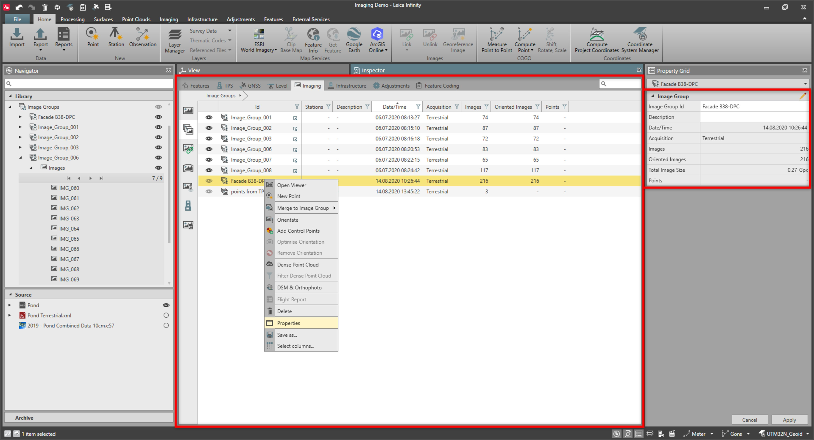

# Image Group Properties

### Image Group Properties

Image group properties can be seen in the property grid, as well as in the imaging inspector.

|  |  |
| --- | --- |

| Name | Description |
| --- | --- |
| Image Group ID | The name of the image group. |
| Description | Any optionally entered description. |
| Date/Time | The date and time of when the image group was created. |
| Source | The name of the image source data. |
| Acquisition | The acquisition type informs whether the image groups are from an aerial or from a ground perspective.Could be:Aerial.Terrestrial.Unknown. |
| Images | Number of images in the image group. |
| Oriented Images | Number of oriented images in the image group. |
| Total Image Size | Overall size of all images contained in the image group. |
| Points | Number of points computed from images. |

**Image Group ID**

**Description**

**Date/Time**

**Source**

**Acquisition**

- Aerial.
- Terrestrial.
- Unknown.

**Images**

**Oriented Images**

**Total Image Size**

**Points**

