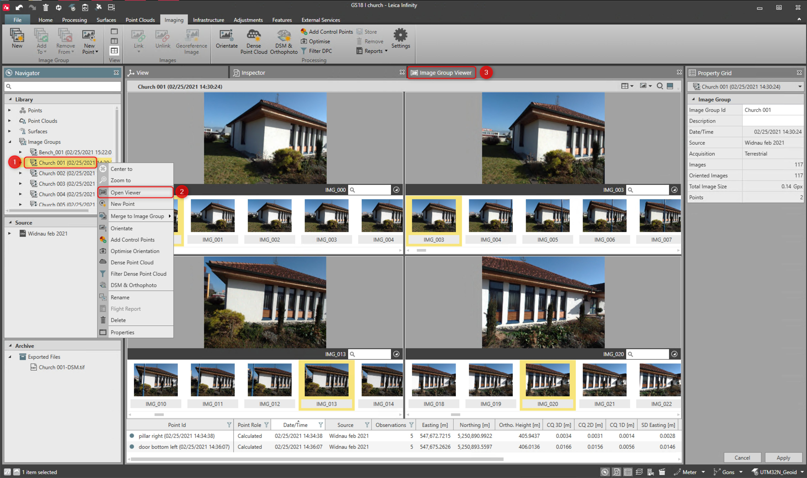
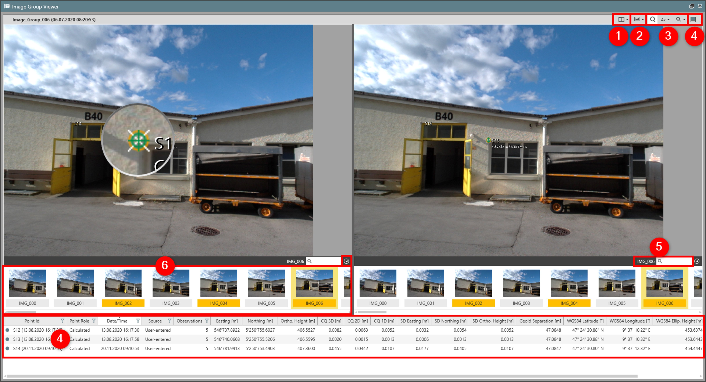

# Image Group Viewer

### Image Group Viewer

To open the image group viewer:

**To open the image group viewer:**

|  |  |
| --- | --- |

| 1. | From the Library or the Inspector, select the Image Group and from the context menu select Open Viewer. |
| --- | --- |
| 2. | The Image Group Viewer opens in a new window. |

**Open Viewer**

In the image group viewer you have the following options:

**In the image group viewer you have the following options:**

|  |  |
| --- | --- |

| No. | Name | Description |
| --- | --- | --- |
| 1. | Display Windows | Set the number of working windows. |
| 2. | Filter | Filter images to display. |
| 3. | Magnifier | Switch magnifier On/Off to help select feature of interest. |
| 4. | Point Table | Show or hide point table. Any points that were computed in the field or in the office are listed in the point table of the open image group. |
| 5. | Search | Search for image name. |
| 6. | Image Strip | Show or hide image strip.For images measured from TPS, each image view allows selecting the TPS station and lists the images that were taken from that station setup.For images measured with GNSS, the GS18 I or UAV, you can select which image to view from the image group. |

**Display Windows**

**Filter**

**Magnifier**

**Point Table**

**Search**

**Image Strip**

- For images measured from TPS, each image view allows selecting the TPS station and lists the images that were taken from that station setup.
- For images measured with GNSS, the GS18 I or UAV, you can select which image to view from the image group.

See also:

**See also:**

The video "Leica Infinity - Imaging Module - How to work with GS18 I data" https://www.youtube.com/watch?v=1TwomI2lxw0

**"Leica Infinity - Imaging Module - How to work with GS18 I data"**

