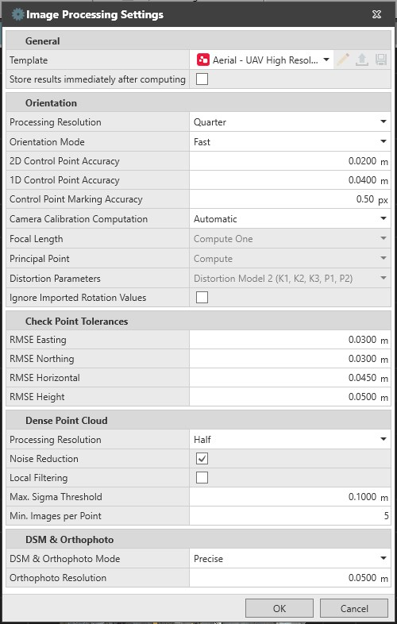

# Image Processing Settings

### Image Processing Settings

Default settings are intended to be the most suitable solution in the majority of cases. Nevertheless, for achieving a better final accuracy or for dealing with specific acquisitions, they have to be often tuned accordingly.

The following settings are available for image processing:

**The following settings are available for image processing:**

|  |  |
| --- | --- |

### General

Store results immediately after computing

**Store results immediately after computing**

The results are stored without any manual intervention.

Templates

**Templates**

A template allows the use of a set of parameters that fit the acquisition best. Choose from predefined templates or create a user template from the currently defined processing settings.

There are four predefined templates available:

**There are four predefined templates available:**

- Aerial − UAV Low Resolution.
- Aerial − UAV High Resolution.
- Terrestrial − GS18 I.
- Terrestrial − Smartphone.

Working with a user template:

**Working with a user template:**

| 1. | To create a new template, set the preferred processing parameters manually, select New... from the template drop-down list and select Save. |
| --- | --- |
| 2. | To edit the name, select the pencil option, enter the new name and accept it. |
| 3. | To save the edited parameters inside the selected template select Save. |
| 4. | To share the current template, select Export. |
| 5. | To import a template, select Load from File from the template drop-down list. |

**New...**

**Save**

**Save**

**Export**

**Load from File**

Changing a setting from a selected template changes the template tab name to Project. The settings are saved until a different template is selected.

### Orientation

Processing Resolution

**Processing Resolution**

The processing resolution is the image resolution, that is used for the orientation step.

- **Full**, resolution uses the original image size for the processing.
- **Half**, resolution uses the images downscaled from the original size by a factor of 4.
- **Quarter**, resolution uses the images downscaled from the original size by a factor of 16.
- **Eighth**, resolution uses the images downscaled from the original size by a factor of 64.

This setting has to be chosen as a trade-off between the final desired quality and the processing time, considering the original image resolution as well. A full resolution process produces more accurate results, exploiting all the information contained in the acquired images, although requiring more time for generating the results

Orientation Mode

**Orientation Mode**

The orientation mode allows the choice between two orientation processing options, precise and fast.

Select Precise, if the orientation processing computes the covariance matrix considering the camera pose accuracy of each image within the selected image group.

**Precise**

To reduce the processing time, there is an option to not calculate the position of the covariances for each image. The output accuracy is then the same as the input.

The precise option provides an improved accuracy of the orientation including the resulting dense point cloud. Consider precise mode when the geometry reconstruction and data accuracy are the important factors of processing results.

Select Fast, if the orientation is processed without computing the covariance matrix. The advantage to the fast option is a quicker orientation result. Consider fast option when accuracy is not the most important factor of processing, such as working with stockpile volume computations or general earth work surfaces.

**Fast**

The precise option requires more hardware RAM during the orientation processing.

When using the fast orientation mode, there is the option to enable CUDA acceleration from File > Preferences > Imaging. This is available for machines using graphic cards with CUDA capabilities (such as NVIDIA GeForce). The benefit is shorter processing times.

**File**

**Preferences**

**Imaging**

Compute Position Covariances

**Compute Position Covariances**

This setting allows the skipping of covariance extraction during precise orientation.

Turn off this setting to reduce the processing time, especially when working with a large number of images in a project. The output accuracy is read from the metadata or from the camera pose accuracy setting.

It is recommended, when working with GS18 I image groups, to process with full resolution, precise mode and compute covariance, to achieve the best results.

When processing large UAV image groups of 20mp or higher resolution and with a good overlap. It is recommended to use fast orientation and a lower resolution setting, to deliver dependable results, but reduce the processing time.

Camera Pose Accuracy

**Camera Pose Accuracy**

This parameter is used to weight properly the GNSS information of the acquired images during the orientation step. It is related to the accuracy of the position of each image and not to the accuracy of the attitude of the UAS itself:

- Use a higher value when the UAS has a low-end GNSS receiver, no accurate RTK position or no raw data collection for post-processing.
- Use a smaller value when the UAS has an accurate RTK GNSS sensor or when collecting raw data for post-processing.

This setting strongly affects the orientation results and all the following steps. Pay attention with the choice of it.

Poor results (noise in the sparse point cloud) might be due to the current camera accuracy, either bigger or smaller than the one set. For example, when dealing with a low quality RTK position (because of interruption of the connection with the reference station or because of the acquisition environment), poor results can be generated due to a camera pose accuracy lower than expected. In this case, a bigger value is of advantage for a better result.

2D Control Point Accuracy/1D Control Point Accuracy

**2D Control Point Accuracy/1D Control Point Accuracy**

The use of control points is recommended for:

**The use of control points is recommended for:**

- Accurate georeferencing of the images and the deliverables that depend on them.
- Calibrating a camera or for improving the existing calibration.

These parameters are used to weight the control point horizontal position (2D) and height (1D) during the orientation step. They should reflect the real accuracy of the measured points.

These settings strongly affect the orientation results and so all the following steps. Pay attention with the choice of it.

These settings are used only for control points that do not have a coordinate quality (CQ 2D or CQ 1D respectively), so when using a point that already has CQ 2D or CQ 1D, the respective setting is ignored for that point.

Control Point Marking Accuracy

**Control Point Marking Accuracy**

This parameter refers to how accurately a control point can be marked on the image. It is used to formulate the weight of the image observations of the control points in the orientation step. If for any reason control points cannot be marked on the images with a subpixel accuracy, for example blurry images, this value must be increased to make it more realistic.

Camera Calibration Computation

**Camera Calibration Computation**

This parameter is connected to the interior orientation of the camera.

- **Automatic**: Default setting. When Ground Control Points (GCP) are used, the parameters of the interior orientation (focal length, principal point and distortion parameters) are estimated. If GCP are not marked on the images (both cases when Check Points (CP) only are used, or when no points at all are marked on the images) the camera calibration is not estimated. For images with interior orientation values stored in the metadata, those values are read and used as initial values: they are kept fixed if the GCP are not marked, estimated if the GCP are marked on the images, as described previously. When interior orientation values are not available, the interior orientation is always computed using the default distortion model.
- **User-Defined**: Using the **User-Defined** option, focal length, principal point and distortion parameters can be set, and the interior orientation parameters are estimated accordingly.

Focal Length

**Focal Length**

The focal length of the camera is read from the image metadata information (EXIF data). The more accurate the initial parameter is, the better the orientation of the images and the more accurate the scale of the reconstruction is. This value can be optimised during camera calibration and is then replaced with either one or two camera constants. These constants are the adjusted focal length equivalents.

- **Compute Two**: The use of two camera constants compensates for the non-squareness of the pixels.
- **Compute One**: In the other cases, the **Compute One** option can be used.
- **Do not compute**: Select **Do not compute** if the camera is already calibrated and the existing values are reliable enough.

A scale issue in the object reconstruction might depend on a wrong used value. Either perform a calibration of the camera or carry out the auto-calibration during the orientation step, to get a more reliable focal length value and a better result in the reconstruction.

Principal Point

**Principal Point**

By default, the principal point it is placed to the centre of each image.

- **Compute**: Select **Compute** to improve the existing value for the principal point.
- **Do not compute**: Select **Do not compute** if the camera is already calibrated and you want to keep the existing values.

Distortion Parameters

**Distortion Parameters**

This parameter controls the distortion of the lenses used to acquire images. The default distortion model works well for most of the frame cameras. However, for cases when additional information about the lens distortion model is available, further models are available:

- **Distortion Model 1 (K1, K2, P1, P2).**
- **Distortion Model 2 (K1, K2, K3, P1, P2). (Default).**
- **Distortion Model 3 (K1, K2, K3, K4, P1, P2, S).**
- **Distortion Model 4 (K1, K2, K3, Kd1, Kd2, Kd3, P1, P2).**
- **Distortion Model 5 (K1, K2, K3, K4, K5, K6, Kd1, Kd2, Kd3, P1, P2, P3, P4, P5, P6, S1, T1).**
- **Do not compute.**
- **None - Undistorted Images.**

| Parameter | Description |
| --- | --- |
| Kx | Radial distortion parameters. |
| Px | Tangential distortion parameters. |
| S | Skew parameter when using Distortion Model 3. |
| S1, T1 | Shear and skew parameter when using Distortion Model 5. |

The focal length, principal point and distortion parameter options are only selectable if the camera calibration computation is set to User-Defined.

Ignore Imported Rotation Values

**Ignore Imported Rotation Values**

When this box is checked, the rotation values stored in the metadata of the images are not used in the orientation process.

Use this setting if imported values are wrong, as in, if the images appear incorrectly rotated or upside down in the graphical view. In all the other cases do not use this setting, since it deteriorates the solution.

### Check Point Tolerances

Along with control points, Infinity supports the use of check points.

In order to have an independent measure for assessing the accuracy of the image orientation, a tolerance for each of the Root Mean Square Error (RMSE) on control points has to be set. The 3D position of the check points is not used during the orientation, yet the computed 3D position of each check point is compared to its current position. The differences are used to evaluate the overall accuracy of the orientation.

The following criteria, derived from ASPRS guidelines, are used to determine when the analysed check point should be considered as out-of-tolerance:

**The following criteria, derived from ASPRS guidelines, are used to determine when the analysed check point should be considered as out-of-tolerance:**

- If the computed RMSE values for Easting, Northing, horizontal or height exceed the ones entered.
- If the absolute value of the mean of Easting, Northing or height exceeds the 25% of the respective RMSE value entered.
- If the absolute value of ΔEasting, ΔNorthing or ΔHeight for a check point exceeds three times the respective RMSE value entered. In this case, the results are marked in bold red text.

### Dense Point Cloud

In the generated Dense Point Cloud (DPC) there can be some outliers, due to blurry images or a poor overlap. A filter can be used to remove them and generate a more accurate DPC.

Processing Resolution

**Processing Resolution**

Similarly, as for the orientation step, there are four processing resolution options to consider when processing a DPC.

Use a higher resolution for the DPC, to achieve a higher density of points. Use a lower resolution for the orientation, to reduce the processing time.

Noise Reduction

**Noise Reduction**

Used to remove inconsistent points above or in front of a reconstructed surface.

Local Filtering

**Local Filtering**

Best used with data sets with high image overlap. Used to remove points that are below or behind a visible surface and to create sharper edges.

Max. Sigma Threshold

**Max. Sigma Threshold**

The max. sigma threshold is the maximum value of the uncertainty (sigma) that a point can have in order not to be filtered out.

- Increasing this value may lead to a more complete but noisier point cloud.
- A smaller value guarantees more accurate points, although reducing the density of the DPC. If a too noisy DPC is generated, a smaller value can be of advantage.

Min. Images per Point

**Min. Images per Point**

This parameter defines the minimum number of images that a point must be seen in to be considered valid.

- Increasing this value reduces the noise, although a lower number of points in the point cloud might be computed. If a too noisy DPC is generated, a bigger value can be of advantage.

### DSM & Orthophoto

DSM & Orthophoto Mode

**DSM & Orthophoto Mode**

Digital Surface Model (DSM) & Orthophoto mode allows the choice between two computation methods, Precise and Fast.

With Precise, a 3D DSM is generated that can better model the dense point cloud. This 3D DSM is used for generating the orthophoto. This method provides the best quality orthophoto output, but can take longer to process.

**Precise**

With Fast, a 2.5D DSM is generated that approximates the model of the dense point cloud. This 2.5D DSM is used for generating the orthophoto. This method has three options for defining the density of the DSM. Each option affects the output of the orthophoto.

**Fast**

Triangle Size

**Triangle Size**

When using the Fast DSM & Orthophoto mode, triangle size can be chosen according to the size of the details to be reconstructed. Use large triangles for the quickest processing time and when fine details are not of interest. Use medium or small triangles to add more detail to the DSM and improve the output of the orthophoto.

Orthophoto Resolution

**Orthophoto Resolution**

This parameter controls the detail level of the orthophoto. Generally, this value can never be smaller than the ground sample distance computed for the image group being processed.

- Decreasing the parameter, increases the resolution of the orthophoto, but also the computation time for its generation.
- Increasing the parameter, decreases the resolution of the orthophoto and reduces the computation time. The orthophoto is smaller in size.

