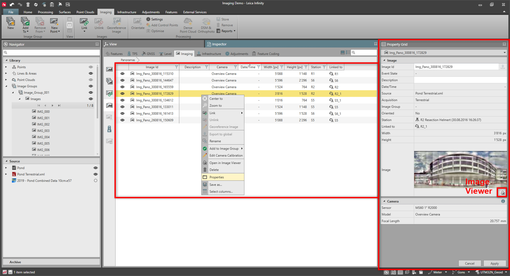

# Image Properties

### Image Properties

Image properties can be seen in the property grid as well as in the imaging inspector.

|  |  |
| --- | --- |

| Name | Description |
| --- | --- |
| Image ID | The name of the image. |
| Event State | This is the GNSS solution type (for example phase fixed RTK or navigated RTK) associated to Leica and DJI UAV images.It indicates the quality of the image position. |
| Description | Any optionally entered description. |
| Date/Time | The date and time of when the image was taken. |
| Source | The name of the image source data. |
| Acquisition | The acquisition type informs whether the images are from an aerial or from a ground perspective.Could be:AerialTerrestrialUnknown |
| Image Group | The ID of the image group which the image belongs to. |
| Oriented | Is indicating if the image has its orientation computed with photogrammetric techniques. |
| Station | The ID of the station on which the image was taken.Station is shown only for TPS images. |
| Linked to | The ID of the object which the image is linked to.Linked to is shown only when the image has a link to an object. |
| Width | Image width in pixels. |
| Height | Image height in pixels. |
| Image | The image itself is displayed as a thumbnail.The image can be opened in a separate image viewer using the icon. |
| Camera | The details of the camera that the image was taken with. |

**Image ID**

**Event State**

**Description**

**Date/Time**

**Source**

**Acquisition**

- Aerial
- Terrestrial
- Unknown

**Image Group**

**Oriented**

**Station**

Station is shown only for TPS images.

**Linked to**

Linked to is shown only when the image has a link to an object.

**Width**

**Height**

**Image**

The image can be opened in a separate image viewer using the icon.

**Camera**

Images are also displayed in the property grid of the objects they are linked to. If you select an object to which one or more images are linked, then the thumbnails of these images are displayed in the properties.

