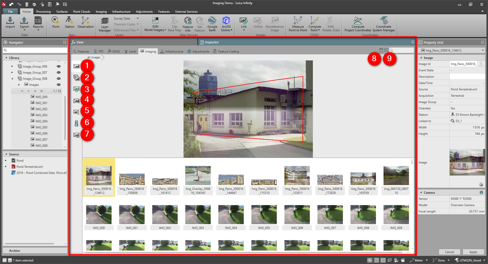

# Imaging Inspector

### Imaging Inspector

From the inspector imaging tab, there are several groups to help you work with images.

|  |  |
| --- | --- |

| No. | Name | Description |
| --- | --- | --- |
| 1. | All images | View all images in a project. |
| 2. | Image Groups | View images by their grouping. |
| 3. | Linked/Not Linked | Sort images by point, line, area feature which images are linked to. |
| 4. | Panoramas | Using TPS imaging sensors, all imported field acquired panorama images are sorted here. |
| 5. | Georeferenced | List of all the images that have been rectified, either by import, using clip base map or from the DSM & Orthophoto processing step. |
| 6. | TPS Setups | View all images that are linked to a total station setup. |
| 7. | Imaging Results | Access imaging results. The view is split in two panes, the results pane and the task pane. |
| 8. | Image Viewer | You can view the selected image in a resizable image viewer that is part of the inspector or in separate window. |
| 9. | Show Thumbnails | Switch between a detailed list or a thumbnail strip of images. |

**All images**

**Image Groups**

**Linked/Not Linked**

**Panoramas**

**Georeferenced**

**TPS Setups**

**Imaging Results**

**Show Thumbnails**

