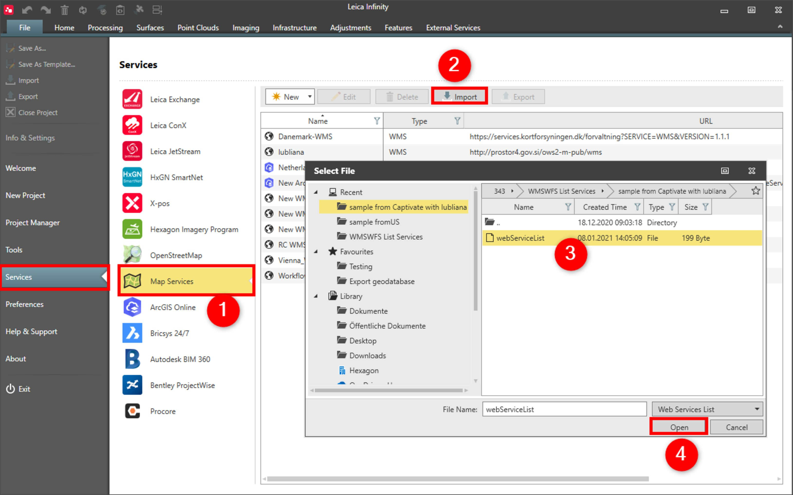

# Import

### Import

The entire list of configured WMS/WMTS/WFS services (including connection name, URL, user name) can be imported from Captivate or from another Infinity user using the webServiceList.fil format.

To import web service list:

**To import web service list:**

|  |  |
| --- | --- |

| 1. | Select File, then Services and then Map Services from the menu. |
| --- | --- |
| 2. | Select Import. |
| 3. | Navigate to the location. |
| 4. | Select Open. |

**File**

**Services**

**Map Services**

**Import**

**Open**

To save the web service list in Captivate use transfer user objects.

Passwords are not exported, add them manually in Captivate or another Infinity instance.

See also:

**See also:**

Get Feature

Base Map

The video "Leica Infinity - Services - How to use the ArcGIS Online service" https://www.youtube.com/watch?v=QgFY17R990o

**"Leica Infinity - Services - How to use the ArcGIS Online service"**

