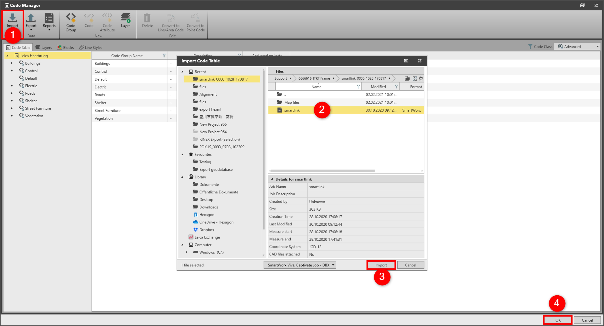

# Import

### Import

The code table content can be built by importing:

**The code table content can be built by importing:**

- Code Tables (*.lic) or (*.xcf).
- SmartWorx Viva, Captivate Job -DBX.
- HeXML/LandXML- XML.
- ESRI Geodatabase.
- Trimble -FXL.
- FlexLine - CLS.

To import codes from existing sources:

**To import codes from existing sources:**

|  |  |
| --- | --- |

| 1. | Open the Code Table and select Import. |
| --- | --- |
| 2. | Navigate to the file you want to import and select it. |
| 3. | Select Import. |
| 4. | Select OK to save the changes and to close the Code Manager. |

**Import**

**Import**

**OK**

After importing a codelist, you may add coding style properties to the imported codes.

See also:

**See also:**

Code Tables

The video "Leica Infinity - Feature Coding Part 1 - How to create a Code Table & Codelist" https://www.youtube.com/watch?v=9Mf8E0trTXA

**"Leica Infinity - Feature Coding Part 1 - How to create a Code Table & Codelist"**

