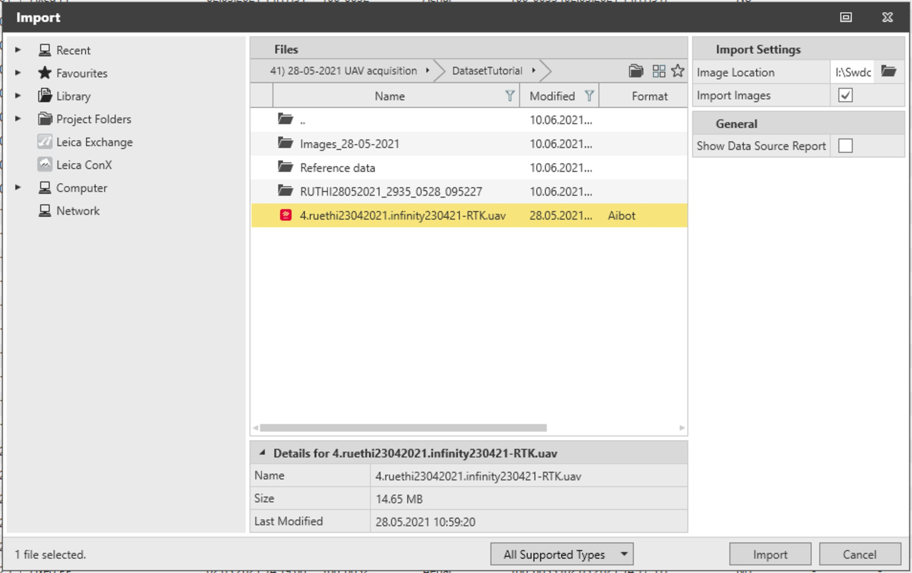
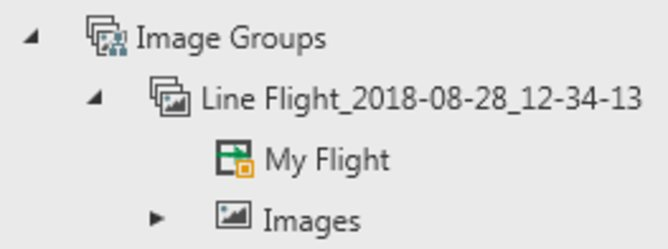
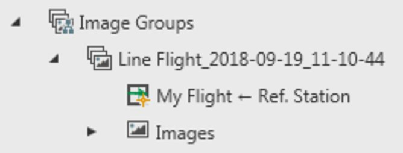

# Import Aibot Data

### Importing Aibot Data

To import Aibot data:

**To import Aibot data:**

|  |  |
| --- | --- |

| 1. | Select the .uav file in the import dialog. |
| --- | --- |
| 2. | Specify the exact path where the images can be found at Image Location. |
| 3. | Select whether to import images or not. If the Import Images checkbox is not selected, images are linked to the project from the import folder. |
| 4. | Select the Import option. |

**Import Images**

**Import**

Once the Aibot file is imported, a points group, an image group and a GNSS tracks group are automatically created. The image group holds the flight object and the images acquired during the flight.

Depending on the type of Aibot licence, at import you can have:

**Depending on the type of Aibot licence, at import you can have:**

|  | Autonomous flight (no GNSS correction received during the flight). |
| --- | --- |
|  | RTK flight (GNSS correction are received during the flight to get very accurate image positions). |

- 

- 

The default name of the image group is the name of the flight.

The position of the images is updated automatically with respect to the flight track. No additional synchronisation is required.

If the position of the RTK base station is updated either by manually updating the station coordinates or by processing it from another reference station, then the flight track is automatically updated. Therefore also the position of the images is updated.

If GNSS raw data have been logged, they can be post-processed in Infinity using a reference station. Once the processing results are stored, the flight track is automatically updated. Therefore also the position of the images is updated.

Information about the flight can be found in the flight report as well as the data source report.

To create a flight report:

**To create a flight report:**

| 1. | Select the image group that contains the Aibot data. |
| --- | --- |
| 2. | Select Flight Report from Reports in the Home ribbon bar or use the context menu. |

**Flight Report**

**Reports**

The flight report includes information about:

- The flight: Start and end time and number of events.
- The sensor: Model, serial number and firmware version.
- The GNSS track: Start and end time, length, receiver name and serial number, sampling rate and so on.
- The GNSS intervals and the reference station (if any).
- The image group: Number of images, size, sensor and camera model.
- The interior orientation of the camera.

The image data from Aibot can be processed using the Imaging Point Clouds module.

