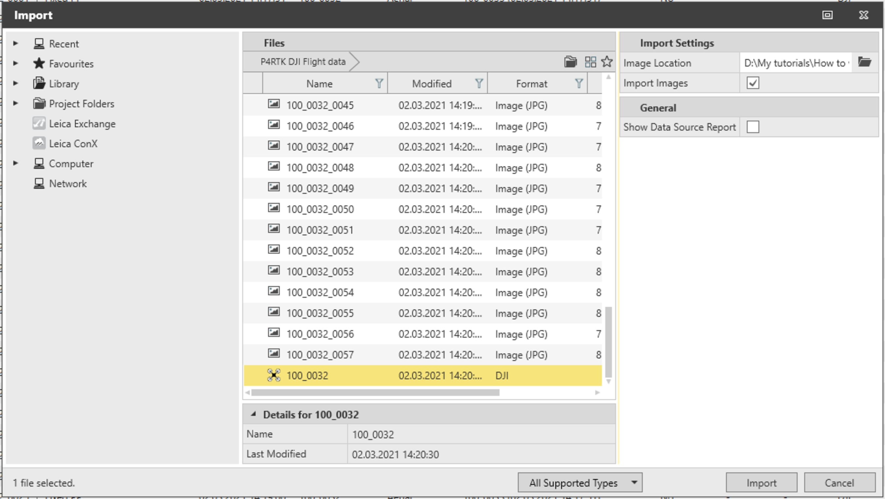
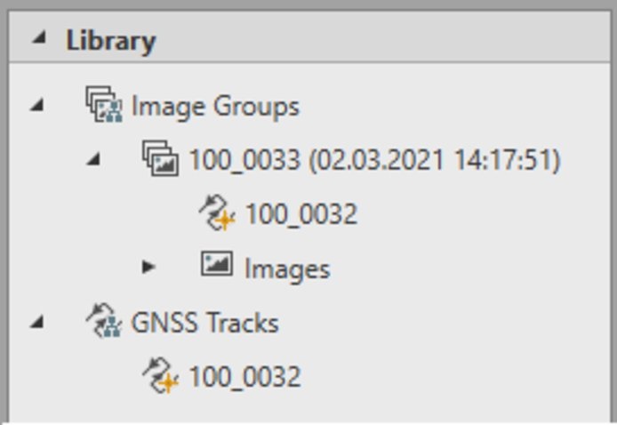

# Import DJI GNSS Flight Data

### Import DJI GNSS Flight Data

To import DJI flight data:

**To import DJI flight data:**

|  |  |
| --- | --- |

| 1. | Select the .dji file in the import dialog. |
| --- | --- |
| 2. | Specify the exact path where the images can be found at Image Location. Default is the current folder. |
| 3. | Select whether to import images or not. If the Import Images checkbox is not selected, images are linked to the project from the import folder. |
| 4. | Select Import. |

**Import Images**

**Import**

Once the DJI file is imported, an image group is created in the library; it has the images and the track.

A GNSS tracks node with the imported track is also created.

The default name of the image group is the name of the flight. It can be modified at any time.

|  |  |
| --- | --- |

When the images are not located in the same folder as the Flight Data, the image location can be set accordingly using the import dialog.

If multiple DJI flights are copied in the same folder, they can be imported together selecting them in the import dialog at the same time.

If multiple DJI flights are in the same folder, and only one is needed, only the images connected to the selected DJI file are imported.

You can drag and drop data into the application using the events .MRK file.

If the GNSS data is not of interest, only the images are imported by selecting them instead of the DJI file.

The GNSS track can be post-processed in Infinity using a reference station. Once the processing results are stored, the positions of the images are automatically updated, and can be used for a standard image-processing workflow.

To create a flight report:

**To create a flight report:**

| 1. | Select the image group that has the DJI data. |
| --- | --- |
| 2. | Select Flight Report from Reports in the Home ribbon bar or use the context menu. |

**Flight Report**

**Reports**

The flight report includes information about:

- The flight: Start and end time and number of events.
- The sensor: Model, serial number and firmware version.
- The GNSS track: Start and end time, length, receiver name and serial number, sampling rate and so on.
- The GNSS intervals and the reference station (if any).
- The image group: Number of images, size, sensor and camera model.
- The interior orientation of the camera.

The image data from DJI can be processed using the Imaging Point Clouds module.

See also:

**See also:**

The tutorial "How to work with DJI drones - GNSS and image processing workflow"

**"How to work with DJI drones - GNSS and image processing workflow"**

The tutorial can be downloaded in the Localisation Tool.

